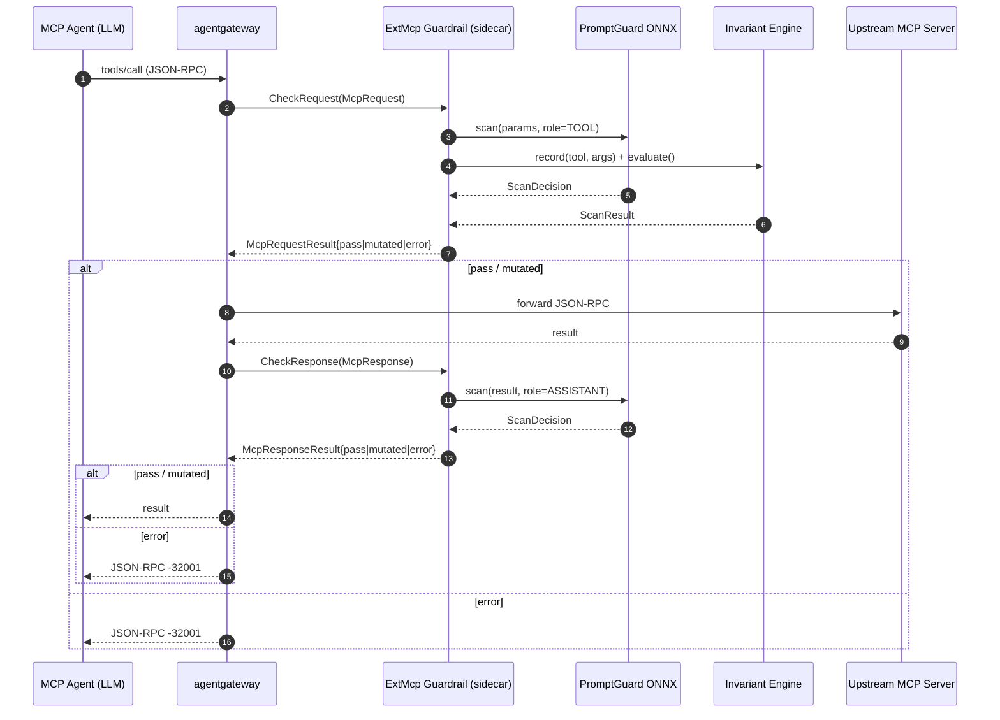

# Architecture

This document is the deep dive. For the quick start and operational knobs see
[`README.md`](README.md); for the dev workflow see
[`CONTRIBUTING.md`](CONTRIBUTING.md).

## Table of contents

- [Design summary](#design-summary)
- [The ExtMcp contract](#the-extmcp-contract)
- [Request lifecycle (CheckRequest)](#request-lifecycle-checkrequest)
- [Response lifecycle (CheckResponse)](#response-lifecycle-checkresponse)
- [The DecisionAggregator](#the-decisionaggregator)
- [The InvariantEngine](#the-invariantengine)
- [Failure and timeout handling](#failure-and-timeout-handling)
- [Hot-reload](#hot-reload)
- [Observability](#observability)
- [Image build](#image-build)
- [Homelab cost tradeoffs](#homelab-cost-tradeoffs)
- [Sequence diagram](#sequence-diagram)
- [Container-internal flow](#container-internal-flow)

---

## Design summary

ExtMcp Guardrail is a policy sidecar that sits between agentgateway and the
upstream MCP servers an agent's LLM can reach. agentgateway invokes the
sidecar twice per MCP exchange — once on the request path (before forwarding
to the upstream), once on the response path (before returning to the agent).
Each call returns one of three states: **pass** (forward unchanged),
**mutated** (replace the payload), or **error** (deny).

The sidecar composes two complementary policy layers:

- A **semantic content layer** built on ONNX
  [PromptGuard-2](https://huggingface.co/gravitee-io/Llama-Prompt-Guard-2-86M-onnx)
  (prompt-injection detection via CPU inference, no torch) plus a
  zero-dependency `RegexScanner` for hidden ASCII / PII / secrets. This
  layer inspects the bytes of a single exchange.
- A **stateful rule layer** inspired by
  [Invariant Labs](https://invariantlabs.ai/)' toxic-flow research. This
  layer inspects the _sequence_ of tool calls inside a sliding window and
  fires on dangerous ordered subsequences ("read inbox then email external")
  and on identical retry loops.

The whole thing is **fail-closed by default**: any scanner exception or
timeout becomes a `BLOCK`, the aggregator denies the exchange, and
agentgateway surfaces a JSON-RPC `-32001` to the agent. For write-capable
agents this is the only safe default — a silent guardrail outage is far
more dangerous than a loud one.

## The ExtMcp contract

The full proto is in [`proto/ext_mcp.proto`](proto/ext_mcp.proto). It
reconstructs the agentgateway ExtMcp v1alpha1 contract. The service has two
RPCs:

```proto
service ExtMcp {
  rpc CheckRequest(McpRequest) returns (McpRequestResult) {}
  rpc CheckResponse(McpResponse) returns (McpResponseResult) {}
}
```

### McpRequest

```proto
message McpRequest {
  repeated string service_names = 1;  // resolved MCP service identifiers
  string method = 2;                  // MCP JSON-RPC method, e.g. "tools/call"
  google.protobuf.Struct metadata_context = 3;
  optional bytes mcp_request = 4;     // raw JSON-RPC params, UTF-8 bytes
  repeated McpHeader headers = 5;     // empty for stdio upstreams
}
```

`mcp_request` is the raw JSON-RPC `params` object, serialised as bytes. For
`tools/call` this looks like `{"name": "...", "arguments": {...}}`. The
servicer treats an absent `mcp_request` as an empty params object and maps a
malformed payload to `AuthorizationError{INVALID}` (fail-closed on parse
failure).

### McpResponse

```proto
message McpResponse {
  repeated string service_names = 1;
  string method = 2;
  google.protobuf.Struct metadata_context = 3;
  bytes mcp_response = 4;              // raw JSON-RPC result, UTF-8 bytes
}
```

`mcp_response` is the raw JSON-RPC `result` object. For `tools/call` this
looks like `{"content": [{"type": "text", "text": "..."}], "isError": bool}`.

### The result oneof

Both `McpRequestResult` and `McpResponseResult` use the same upstream
`oneof result` shape:

```proto
message McpRequestResult {
  oneof result {
    Pass pass = 1;                    // forward unchanged
    bytes mutated = 2;                // replace payload with raw JSON bytes
    AuthorizationError error = 3;     // deny / invalid / resource exhausted
  }
  HeaderMutation header_mutation = 4;
  google.protobuf.Struct metadata = 5;
}

// McpResponseResult has the same pass/mutated/error oneof, without the
// request-side header_mutation/metadata extension fields.
```

The sidecar emits `pass`, `mutated`, and `error`, and populates
`McpRequestResult.metadata` on every request-side verdict with
`guardrail.scan_score` (max scanner score), `guardrail.rules_hit`
(invariant rules that fired), `guardrail.redactions` (substitution count),
`guardrail.exchange_id` and `guardrail.outcome` (`allow` / `mutated` /
`deny`). `McpResponseResult` has no `metadata` field in the proto, so
metadata is request-side only. `header_mutation` is deliberately not
emitted: a caller-visible `x-guardrail-ref` header adds nothing over the
wire `ref` already present in the deny reason (documented in
`guardrails/servicer.py::_result_metadata`).

### Upstream contract note

`proto/ext_mcp.proto` is vendored from `agentgateway/agentgateway` at commit
`1e0c75efc930187fb6048ac5c05fe7b62b787352`
(`crates/protos/proto/ext_mcp.proto`). The "forward unchanged" oneof member
is named `pass`; the Python servicer sets it via `getattr(result, "pass")`
because `pass` is a Python keyword. Only protobuf field numbers and types
participate in the wire format.

### AuthorizationError codes

```proto
message AuthorizationError {
  enum Code {
    UNKNOWN = 0;
    PERMISSION_DENIED = 1;    // call not permitted by policy
    RESOURCE_EXHAUSTED = 2;   // rate/size/resource exhaustion
    INVALID = 3;              // payload malformed / not deserialisable
  }
  Code code = 1;
  string reason = 2;
  optional bytes mcp_error = 3;
}
```

The servicer emits `PERMISSION_DENIED` for aggregator denies and `INVALID`
for JSON parse failures on the incoming `mcp_request` / `mcp_response`
bytes. On policy denies (`PERMISSION_DENIED`), `mcp_error` carries a
structured JSON-RPC 2.0 error body: `code: -32001`, `message` equal to the
generalised wire `reason` (same correlation `ref`), and `data` with a
generalised policy `category` + `remedy` hint — pattern names, rule
internals and match detail never leave the audit log.

### McpHeader and metadata context

```proto
message McpHeader {
  string key = 1;
  bytes value = 2;
}
```

`headers` is empty when `metadata_context["upstream_transport"] == "stdio"` —
stdio MCP servers do not have HTTP headers. The servicer pulls
`upstream_transport` and `route_name` out of the
`google.protobuf.Struct metadata_context` and threads them through to the
engine for audit logging; it does **not** rely on headers for any
authn/authz decision.

## Request lifecycle (CheckRequest)

The request path is the busier of the two: it does double duty (content
scan + invariant trace). The call graph, step by step:

1. **`ExtMcpServicer.CheckRequest(request, context)`**
   ([`guardrails/servicer.py`](guardrails/servicer.py))
   - `_safe_json_loads(request.mcp_request)` — if parse fails, return
     `McpRequestResult{error=INVALID}` immediately.
   - `_extract_metadata(request)` — pull `upstream_transport` and
     `route_name` out of the `google.protobuf.Struct metadata_context`.
   - For `tools/call`: extract `tool_name = params["name"]`.
   - Extract request headers into a plain dict.
2. **`GuardrailEngine.check_request(...)`**
   ([`guardrails/engine.py`](guardrails/engine.py))
   - Build an `McpCallContext` carrying method, service_names, tool_name,
     params, headers, transport, route.
   - `texts, truncated = scan_windows(extract_text(params), max_content_bytes, scan_tail_bytes)` —
     `extract_text` flattens the params dict to a scan string with
     `ensure_ascii=False` (critical: hidden Unicode in argument values
     survives to the regex scanner). `truncate` cuts on a UTF-8 boundary
     at `MAX_CONTENT_BYTES` (default 32 KiB) and returns a `truncated`
     flag that is folded back into the context for audit.
   - Open an OTel span `guardrail.check_request` with `method`, `tool`,
     `transport` attributes.
3. **Tool ACL** (before any scanner) — for `tools/call` with a non-empty
   tool name, `_tool_acl_violation(tool, ALLOW_TOOLS, DENY_TOOLS)` denies
   immediately (`tool_acl` scanner result): DENY list wins, and a non-empty
   ALLOW list acts as a whitelist (`prefix/*` wildcards supported). An ACL
   deny short-circuits the content scanners.
4. **Content scanners** — `_run_scanners(text, role="tool",
self._c.request_scanners, context=ctx)` (the `McpCallContext` is threaded
into every scanner's `context` kwarg):
   - `RegexScanner` (zero-dep, always on unless `ENABLE_REGEX_SCANNER=0`)
     — first-match-wins over `default_patterns()`: hidden ASCII, private
     keys, AWS / GitHub / GitLab / Slack tokens, high-entropy blobs,
     credit cards, emails.
   - `OnnxPromptGuardScanner` (lazy import; falls back to regex-only if
     `onnxruntime` / `transformers` is absent) —  PromptGuard-2 for the
     `TOOL` role.
   - Each scanner runs under `asyncio.wait_for(..., timeout)` with the
     deadline set to `SCANNER_TIMEOUT_MS / 1000`. Timeouts and exceptions
     are translated per `FAILURE_MODE` (see
     [Failure and timeout handling](#failure-and-timeout-handling)).
5. **Invariant trace** — under `self._trace_lock` (serialises concurrent
   requests so traces cannot interleave half-calls):
   - `self._c.invariant.record(tool_name, params.get("arguments", {}), key=trace_key)` —
     appends a `TraceEntry(tool, args)` to the bounded `deque(maxlen=256)`,
     only for `tools/call` with a non-empty tool name; `trace_key` is the
     route name (or `route|header=value` when
     `INVARIANT_TRACE_KEY_HEADERS` matches).
   - `self._c.invariant.evaluate_or_allow(key=...)` — runs every rule in priority
     order against the resulting trace; first-match wins and returns a
     `BLOCK` `ScanResult`, otherwise `ALLOW`.
6. **`DecisionAggregator.aggregate(results)`** — combines every
   `ScanResult` into a single `Decision` (see
   [The DecisionAggregator](#the-decisionaggregator)). Request-side
   redaction of `params.arguments` exists (`REDACT_REQUEST_PARAMS=1`) but is
   **off by default** — a secret in tool-call params is BLOCKed by the
   `RegexScanner`, not rewritten.
7. **Observability** — set span outcome (`deny` / `mutated` / `allow`),
   `record_decision(phase="request", method, tool_name, ctx, decision)`
   emits the JSONL audit line and bumps the
   `mcp.guardrails.decisions{phase="request",outcome,method}` counter.
8. **`ExtMcpServicer` maps the `Decision` to the proto oneof**:
   - `decision.deny` -> `McpRequestResult{error=PERMISSION_DENIED}`.
   - `decision.is_mutated` -> `McpRequestResult{mutated=<raw json bytes>}`.
   - otherwise -> `McpRequestResult{pass=Pass()}`.

## Response lifecycle (CheckResponse)

The response path is the **indirect-injection frontline**. A tool that
returns attacker-controlled text (a fetched web page, a database row, a
file's contents, another agent's chat message) is exactly the channel
through which instructions-to-the-LLM sneak back into the agent's context.
Scanning that text as the `ASSISTANT` role before it reaches the agent is
the single highest-leverage defence in the sidecar.

The call graph:

1. **`ExtMcpServicer.CheckResponse(request, context)`** — same shape as
   `CheckRequest` but deserialises `request.mcp_response`. Malformed ->
   `McpResponseResult{error=INVALID}`.
2. **`GuardrailEngine.check_response(...)`**:
   - Build `McpCallContext` (no `tool_name` on the response side; the
     method + result are what we have).
   - `texts, truncated = scan_windows(extract_text(result), max_content_bytes, scan_tail_bytes)` —
     `extract_text` for a `tools/call` result pulls `content[].text` out of
     the result envelope; for a `tools/list` result it concatenates every
     tool's `description` + JSON-dumped `inputSchema` (to catch description
     poisoning); for everything else it falls back to a JSON dump with
     `ensure_ascii=False`.
   - Open OTel span `guardrail.check_response`.
3. **First-stage content scanners** — `_run_scanners(text, role="assistant",
self._c.response_scanners)`:
   - `RegexScanner` — same patterns as request side (a private key in tool
     output is just as bad as one in params).
   - `OnnxPromptGuardScanner` — PromptGuard with role `ASSISTANT`. The
     default role map does **not** enable `AGENT_ALIGNMENT` for the
     assistant role at the first stage (see the next step).
4. **Optional second-stage AgentAlignment** — only when **both** are true:
   - `self._c.second_stage_scanners` is non-empty (i.e.
     `ENABLE_AGENT_ALIGNMENT=1`).
   - At least one first-stage scanner returned `ScanOutcome.HUMAN_REVIEW`.
     When the gate fires, `_run_scanners(text, role="assistant",
self._c.second_stage_scanners)` runs and the results are appended to the
     aggregator input. The span gets `second_stage=True`.
     This is the cost-control knob from the original design: AgentAlignment
     is LLM-based (~300-800ms per call). Running it on every response would
     dominate sidecar latency and homelab cost; gating it on first-stage
     suspicion bounds the alignment cost to suspicious responses only.
5. **No Invariant on the response side** — toxic-flow is a request-time
   property. The trace records `(tool, args)` on the request; the response
   carries no tool identity to record.
6. **Redaction (mutation stage)** — `GuardrailEngine._redact(...)` runs the
   `RedactionScanner` transformer ([`guardrails/redaction.py`](guardrails/redaction.py))
   over the result **whenever the aggregate decision is not a deny** (a
   `BLOCK` always wins). `HUMAN_REVIEW` payloads are redacted too when
   `REDACT_ON_REVIEW=1` (default): the review verdict is preserved — the
   aggregator's `human_review` flag and the audit outcome are untouched —
   and the mutated payload rides alongside via the `mutated` oneof, so
   review-grade PII is masked instead of passing through verbatim.
   `REDACT_ON_REVIEW=0` restores the legacy behaviour (review payloads
   pass+warn unmutated). The transformer recursively
   walks the result JSON and rewrites string values, replacing secret/PII
   matches (emails, credit cards, cloud/chat/LLM tokens, PEM private-key
   blocks) with `[REDACTED:<TYPE>]` placeholders. Because it walks the
   structure rather than the flattened scan text, the mutated payload is
   always valid JSON with the same shape as the original. On any
   substitution the engine attaches it as `Decision.mutated`, adds a
   `redaction:N substitution(s)` marker to the reason, and sets the
   `redactions=N` span attribute; the servicer maps it to
   `McpResponseResult{mutated=<raw json bytes>}`. No substitutions -> plain
   `pass`. Disabled with `ENABLE_REDACTION=0`. The regex sweep runs via
   `asyncio.to_thread` (a multi-MB payload must not stall the event loop),
   and payloads larger than `REDACTION_MAX_BYTES` (default 256KiB) skip
   redaction entirely — they pass through unchanged with
   `redaction_skipped=size` in the audit span. Skipping is safe: block-grade
   secrets in an over-cap payload are still denied by the RegexScanner on
   the head+tail scan windows before redaction would run.
7. **Aggregate, observe, map to oneof** — same as the request path, but
   `phase="response"` in the audit record and counter.

## The DecisionAggregator

The aggregator ([`guardrails/aggregator.py`](guardrails/aggregator.py)) is
a stateless combinator over a list of `ScanResult`. The fail-closed table:

| Inputs                           | `human_review_mode=pass`                              | `human_review_mode=deny`                                       |
| -------------------------------- | ----------------------------------------------------- | -------------------------------------------------------------- |
| All `ALLOW`                      | `Decision(deny=False)` (allow)                        | `Decision(deny=False)` (allow)                                 |
| Any `BLOCK`, no `HUMAN_REVIEW`   | `Decision(deny=True, reason="<scanner>:block:...")`   | `Decision(deny=True, reason="<scanner>:block:...")`            |
| Any `BLOCK`, some `HUMAN_REVIEW` | `Decision(deny=True)` — BLOCK wins                    | `Decision(deny=True)` — BLOCK wins                             |
| No `BLOCK`, any `HUMAN_REVIEW`   | `Decision(deny=False, human_review=True)` (pass+warn) | `Decision(deny=True, reason="...:human_review_escalated:...")` |
| Engine supplies `mutated=...`    | `Decision(deny=False, mutated=...)` (passthrough)     | `Decision(deny=False, mutated=...)` (passthrough)              |

Two invariants hold by construction:

1. **`BLOCK` always wins.** No `HUMAN_REVIEW_MODE` setting can downgrade a
   `BLOCK` to a pass. This is the load-bearing security property.
2. **Mutation passthrough.** If the engine supplies a `mutated` payload
   (as the implemented redaction stage does — see
   [Response lifecycle (CheckResponse)](#response-lifecycle-checkresponse))
   and no scanner blocks, the aggregator
   forwards the mutation unchanged. The mutation is the engine's
   responsibility; the aggregator never synthesises one.

The `reason` field always records the offending scanner (`reason` is
`"<scanner>:block:<reason>"` on a deny, `"<scanner>:review"` on a
review-pass), so the audit log identifies the firing policy without
re-running the scan.

## The InvariantEngine

The InvariantEngine ([`guardrails/invariant.py`](guardrails/invariant.py))
is the rule layer. It is deliberately dependency-free and synchronous;
rule evaluation is microsecond-order, so no `to_thread` wrapping is
required.

### Sliding window

Traces are **isolated per route**: the engine keys each trace by the request's
route name (falling back to the first service name), and the InvariantEngine
keeps one `collections.deque(maxlen=window)` (default `window=256`) per key in
an LRU map bounded by `INVARIANT_MAX_TRACES` (default 1024, least-recently-used
tenant evicted). The trace key is the route name by default; when
`INVARIANT_TRACE_KEY_HEADERS` is configured and the header is present, the key
becomes `route|header=value` for per-session isolation (missing header ->
route dimension). Only `tools/call` requests with a non-empty tool name are
recorded. This prevents cross-tenant contamination: interleaved calls
from different agents can neither assemble a cross-tenant toxic flow nor trip
a loop rule against each other's history, and a key-flooding client cannot
grow memory without bound.

`record(tool, args, key=...)` appends a `TraceEntry(tool, args)` to the key's
deque. When the deque is full, the oldest entry is evicted automatically —
this caps memory and rule-evaluation cost (bound: window x
`INVARIANT_ARGS_MAX_BYTES` x `INVARIANT_MAX_TRACES`). The window should be
large enough to span a typical agent tool-use chain; the default of 256
covers long multi-step plans.

**Sticky partial-match progress (S-H4).** When a `ToxicFlowRule` matches a
PREFIX of its steps (e.g. step 0 of 2), the progress is parked in a sticky
map keyed `(trace_key, rule_name)` with a TTL (`INVARIANT_STICKY_TTL_S`,
default 600s) and the same LRU bound as the trace map. Later evaluations
resume matching from the parked step, so a flow whose early steps slide out
of the window still completes. Progress that is not extended ages out; a
full match clears the entry.

### Ordered subsequence matching (`ToxicFlowRule`)

A `ToxicFlowRule` is a list of `FlowStep`s. The rule fires when **all**
steps match in order within the current trace window. Steps need not be
contiguous — intervening calls are allowed. This models real agent
behaviour, where a dangerous pattern is spread across several intermediate
steps:

```text
trace:    [inbox_read, search, summarise, email_send(to=external)]
rule:     [inbox_read, email_send(to=external)]
                                                    ^^^^ fires here
```

The matcher is greedy left-to-right: for each trace entry, if it matches
the current step, advance the step index. The rule fires when the step
index reaches `len(steps)`. First-match wins across rules in priority order.

### LoopRule fingerprint repetition

A `LoopRule` fires when the same `(tool, args)` fingerprint repeats
`threshold` times within the window. The fingerprint is
`f"{tool}:{json.dumps(args, sort_keys=True, default=str)}"` — so two calls
with the same tool but different args (a parameterised search) do **not**
share a fingerprint. This is what distinguishes a genuine retry loop
(prompt-injection signature: a compromised agent hammering a denied tool
over and over) from normal agent exploration.

### Dotted-path arg matchers

Each `FlowStep` carries an optional `args: Mapping[str, ValueMatcher]`.
The keys are dotted paths resolved against the args dict via
`_resolve_path(data, path)`:

- `"to.address"` -> `args["to"]["address"]`
- `"recipients.0.email"` -> `args["recipients"][0]["email"]` (integer
  segments are list indices)
- Missing segments resolve to `None` (which the value matcher is expected
  to handle — typically via a callable `isinstance(v, str) and ...`).

Value matchers follow the same regex-vs-literal heuristic as tool matchers:
strings containing regex meta-characters are compiled and `.search()`ed;
other strings use literal `==`; callables are invoked; compiled
`re.Pattern` objects are searched.

## Failure and timeout handling

Each scanner runs under `asyncio.wait_for(scanner.scan(content, role),
timeout=SCANNER_TIMEOUT_MS / 1000)` inside
`GuardrailEngine._run_scanners`. Two failure modes:

- **`asyncio.TimeoutError`** — the scanner exceeded the per-call deadline.
  Translated to `ScanResult.block(scanner_name, f"timeout>{ms}ms")` under
  `failClosed`, or `ScanResult.review(scanner_name, f"failopen:timeout>...")`
  under `failOpen`.
- **Any other `Exception`** — translated to
  `ScanResult.block(scanner_name, f"error:{type(exc).__name__}:{exc}")` under
  `failClosed`, or `ScanResult.review(scanner_name, f"failopen:error:...")`
  under `failOpen`.

Under `failClosed` (the default), both paths produce a `BLOCK` -> the
aggregator denies -> `error` oneof -> agentgateway returns JSON-RPC
`-32001`. Under `failOpen`, both produce a `HUMAN_REVIEW` -> the
aggregator either passes with an audit warning (`HUMAN_REVIEW_MODE=pass`)
or escalates to a deny (`HUMAN_REVIEW_MODE=deny`).

Keep `SCANNER_TIMEOUT_MS` strictly less than the agentgateway
`mcp-guardrails` processor timeout (recommended sidecar 500ms, gateway
800-1000ms) so the sidecar always decides first — a sidecar that times out
_after_ the gateway has already failed-closed is just noise.

### Sidecar-unreachable

If the sidecar Pod is unreachable (CrashLoopBackoff, network policy drop,
ready-Pod-count-zero), agentgateway's `mcp-guardrails` processor fails
closed by configuration (`failureMode: FailClosed` in the
`AgentgatewayPolicy` CRD). The MCP exchange is denied and the agent
receives JSON-RPC `-32001`. This is the second layer of fail-closed
defence — even a total sidecar outage cannot let an unguarded exchange
through.

### Model load failure

The server's gRPC health service (`grpc.health.v1`) only goes `SERVING`
after `engine.awarm()` completes (which touches each scanner once to force
lazy model init). If the PromptGuard-2 model load fails, the health check
stays `NOT_SERVING`, the readiness probe never passes, and the Pod is
removed from the Service endpoints. No traffic reaches a half-initialised
sidecar.

The same health signal doubles as a **runtime degradation** verdict
(A-P0-4): a background watchdog re-evaluates `engine.healthy` every 2s.
The engine keeps a sliding window of the last
`UNHEALTHY_SCANNER_WINDOW` (default 100) scanner invocations; once at
least `UNHEALTHY_SCANNER_MIN_SAMPLES` (default 20) invocations are
recorded and the error/timeout fraction exceeds
`UNHEALTHY_SCANNER_ERROR_RATE` (default 0.5), health flips to
`NOT_SERVING` — and flips back automatically as the failures age out of
the window. The rate is tracked under `failOpen` too, so a degraded
scanner is visible to the orchestrator even when exchanges are still
being allowed.

### Malformed JSON

The servicer's `_safe_json_loads` catches `json.JSONDecodeError` and
`UnicodeDecodeError` and maps both to `AuthorizationError{INVALID}`.
This is fail-closed on parse failure: a malformed payload cannot reach the
engine.

### Large result truncation

Tool output can be multi-MB; scanning it whole blows the inference latency
budget and risks OOM. `scan_windows(text, MAX_CONTENT_BYTES, SCAN_TAIL_BYTES)`
cuts a UTF-8-safe head window (default 32 KiB) and — for over-budget payloads —
a mid window (centred on the unscanned remainder) plus a tail window (default
8 KiB each). All chunks are scanned; the `truncated` flag is folded into the
audit record (`truncated: true` in the JSONL line) and the OTel span attribute,
alongside `scanned_bytes` / `total_bytes` coverage counters. The tail window
closes the **truncation bypass** (padding that pushes the injection beyond the
32 KiB head) and the mid window closes the **mid-payload blind spot** (padding
that pushes it past the head but short of the tail). Set `SCAN_TAIL_BYTES=0`
to revert to head-only scanning.

Payloads beyond the `SCAN_MAX_PAYLOAD_BYTES` hard cap (default 1 MiB) are
still scanned via the three windows, but the engine additionally attaches a
`payload_size` `HUMAN_REVIEW` result whose reason carries the scanned/total
byte counts — `HUMAN_REVIEW_MODE` then resolves pass+warn vs deny, so under
fail-closed review handling a giant, mostly-unscanned payload cannot pass
silently.

## Hot-reload

The `RulePack` class ([`guardrails/rules/__init__.py`](guardrails/rules/__init__.py))
holds the active rule tuple behind an `RLock`. `RulePack.reload()`
re-reads the rule pack from the configured source
(`INVARIANT_RULES_PATH` / `INVARIANT_RULES_MODULE`) and swaps the tuple
atomically:

- The swap is under the `RLock`, so a concurrent `reload()` cannot tear a
  rule list out from under an in-flight `InvariantEngine.evaluate()`.
- Rule objects themselves are immutable (dataclasses with frozen-ish
  semantics via `__post_init__` normalisation), so once a snapshot is
  taken for evaluation the rule list cannot be mutated mid-evaluation.
- The `InvariantEngine._traces` per-route trace map (LRU-bounded by
  `INVARIANT_MAX_TRACES`) is guarded separately by an
  `asyncio.Lock` in the engine, so the trace append/evaluate pair is
  atomic with respect to other concurrent requests.

`server.py` installs a `SIGHUP` handler that calls
`RulePack.from_env()` and swaps the live `InvariantEngine._rules` list.
Operators reload rules without dropping the gRPC server:

```bash
# inside the container
kill -HUP 1

# or from the host (K8s)
kubectl exec -n agent-system deploy/mcp-guardrails -- kill -HUP 1
```

If the new rule pack fails to load (syntax error, missing `RULES`
attribute), the handler logs a warning and the old rules stay active — a
broken reload cannot leave the sidecar rule-less. Both outcomes are also
recorded durably: every reload attempt emits a
`{"event": "rules_reload", "ok": …, "rules_version": …, "error": …}` audit
line and bumps the `mcp.guardrails.rules_reload{result=success|error}`
counter (A-P1-3).

## Observability

Two always-on telemetry paths plus one optional one.

### JSONL audit log (always on)

`AuditSink` ([`guardrails/otel.py`](guardrails/otel.py)) writes one JSON
line per decision. Defaults to stdout when `AUDIT_LOG_PATH` is unset or
`-`. Every line carries:

```json
{
  "ts": 1730000000,
  "ts_ms": 1730000000123.456,
  "phase": "request",
  "method": "tools/call",
  "tool": "email_send",
  "outcome": "deny",
  "reason": "regex:hidden_ascii:block:hidden/control unicode detected (match_len=1 match_sha256=a1b2c3d4e5f6)",
  "ref": "f9c27670",
  "exchange_id": "gw-req-42",
  "caller": "alice",
  "payload_sha256": "0a1b2c3d4e5f",
  "rules_version": 3,
  "sidecar_version": "0.3.5",
  "duration_ms": 4.21,
  "truncated": false,
  "scanned_bytes": 512,
  "total_bytes": 512,
  "upstream_transport": "streamable_http",
  "route": "filesystem-mcp",
  "scanners": [
    {
      "scanner": "regex:hidden_ascii",
      "outcome": "block",
      "reason": "...",
      "score": 0.9
    },
    { "scanner": "invariant", "outcome": "allow", "reason": "", "score": 0.0 }
  ]
}
```

Field notes (Wave-2 audit expansion):

- `ts` is epoch **seconds** as an int; millisecond precision is available
  via the sibling `ts_ms` field (epoch milliseconds, float). Both are
  sampled from the same `time.time()` call.
- `ref` and `exchange_id` are two **distinct** ids. `ref` is always an
  engine-minted random uuid8: the JSON-RPC payload `id` is
  attacker-controlled and is never trusted, so the wire deny reason
  (`denied by content policy (ref …)`) can never be pre-computed or
  spoofed by a caller. `exchange_id` is the cross-line correlation id,
  resolved by the servicer only from trusted, dataplane-injected channels:
  an agentgateway `metadata_context` key (`exchange_id` / `request_id` /
  `x_request_id` / `trace_id`), else the `x-request-id` header, else a
  fresh uuid8 fallback. Every accepted candidate is sanitised before use
  (whitespace stripped, CR/LF and all other C0/C1 control characters
  removed to prevent audit-log line injection, length capped at 64
  chars). When the dataplane supplies a stable id, the request- and
  response-side lines of one MCP exchange grep together on `exchange_id`.
- `caller` is copied only from the `AUDIT_CALLER_HEADERS` whitelist
  (default `x-forwarded-user` only — `x-session-id` is a quasi-credential
  and must be opted in explicitly); other headers never reach the
  audit log. The response side has no headers on the wire, so `caller` is
  empty there — correlate via `exchange_id` instead.
- `payload_sha256` is the 12-hex-char SHA-256 prefix of the scanned text
  (correlation without storing payload content); `rules_version` is the
  monotonic rule-pack version; `sidecar_version` the build version
  (`GUARDRAIL_VERSION` override, else the package version); `duration_ms`
  the decision latency.
- Scanner reasons never embed raw matches or LLM output: regex matches use
  the `match_len` / `match_sha256|match_hmac` fingerprint, and
  AgentAlignment verdicts record only a length fingerprint
  (`match_len=N`) — raw LLM observations are never persisted.

The audit log is the durable, GitOps-friendly record that survives even
when OTel collection is down. In K8s, point `AUDIT_LOG_PATH` at a mounted
volume (or leave it on stdout and let your container log collector pick it
up).

### OTel spans and metrics (optional)

When `OTEL_EXPORTER_OTLP_ENDPOINT` is set and the `opentelemetry-sdk` is
importable, `Observability._init_otel` wires up:

- A `TracerProvider` with a `BatchSpanProcessor` over
  `OTLPSpanExporter(endpoint=..., insecure=True)`. Each decision opens a
  span (`guardrail.check_request` / `guardrail.check_response`) carrying
  `method`, `tool`, `transport`, `outcome`, `reason`, `duration_ms`, and
  (on the response side) `second_stage` attributes.
- A `MeterProvider` with a `PeriodicExportingMetricReader` (15s export
  interval) over `OTLPMetricExporter`. Instruments registered (all labels
  are low-cardinality by construction — see the cardinality rule below):

  | Instrument | Type | Labels |
  |---|---|---|
  | `mcp.guardrails.decisions` | counter | `phase`, `outcome`, `method` |
  | `mcp.guardrails.decision_duration_ms` | histogram (ms) | `phase`, `outcome` |
  | `mcp.guardrails.scanner_results` | counter | `scanner`, `outcome` (incl. `error` / `timeout`) |
  | `mcp.guardrails.redactions` | counter | — |
  | `mcp.guardrails.invariant_hits` | counter | `rule` (rule-pack names only) |
  | `mcp.guardrails.rules_reload` | counter | `result` (`success` / `error`) |

  **Cardinality rule:** metric labels are restricted to bounded enums —
  phase/outcome/method, configured scanner names, loaded rule-pack rule
  names, reload result. Per-exchange values (`ref` / `exchange_id`, tool
  name, caller, payload hashes) must NEVER become metric labels; they
  belong in the audit log only.

If the SDK is absent or the endpoint is unreachable, the sidecar degrades
to audit-only operation (a warning is logged at startup). The audit log is
the floor; OTel is the ceiling.

### Log levels

`configure_logging(level)` (also in `otel.py`) sets up `logging.basicConfig`
to stderr with the format
`%(asctime)s %(levelname)s %(name)s :: %(message)s`. `LOG_LEVEL=DEBUG` is
useful for tracing scanner decisions; `LOG_LEVEL=WARNING` is the
recommended production setting (only failures and reloads are logged).

## Image build

The Dockerfile is multi-stage:

1. **`base`** — `python:3.11-slim`, `ca-certificates` + `curl` for the
   healthcheck, env vars `PYTHONUNBUFFERED=1`, `PYTHONDONTWRITEBYTECODE=1`,
   `HF_HOME=/models/hf`.
2. **`builder`** — `pip install --prefix=/install -r requirements.txt`
   with a BuildKit pip cache mount. Build tools do not leak into runtime.
3. **`models`** — pre-downloads the public ONNX PromptGuard-2-86M model
   (`gravitee-io/Llama-Prompt-Guard-2-86M-onnx`) into `/models/hf/pg2` via
   `huggingface_hub.snapshot_download`. The model is a flat `.onnx` file
   (~350MB) loaded at runtime by `onnxruntime.InferenceSession` directly —
   no `torch`, no `optimum`. A BuildKit cache mount (`/hf-cache`) with
   `hf-xet` parallelises the download (2-5x faster).
   If the model is unavailable at build time (air-gapped build, HF outage),
   the build still succeeds — runtime will lazy-fetch on first scan (guarded
   by a 30s warmup deadline). This stage is what makes the image air-gappable
   and cold-start fast: no 5-10s HF download on first request.
4. **`runtime`** — `python:3.11-slim`, `useradd -u 65532 nonroot`, copies
   `/install` from builder and `/models/hf` from models, copies the app
   (`proto/`, `guardrails/`, `server.py`) into `/app`, sets
   `PYTHONPATH=/app`, `USER 65532:65532`, `EXPOSE 9001`. The `HEALTHCHECK`
   uses an inline Python `grpc.health.v1` probe (zero extra system deps —
   no `grpcurl` needed).

Final image is ~600 MB (onnxruntime + model weights, torch-free). The
container runs as UID/GID 65532 (matching the K8s `securityContext.runAsUser`).

The ONNX stack is the **default and only path** — the old torch-based
LlamaFirewall pipeline was dropped in 0.2.1 in favor of direct
`onnxruntime.InferenceSession` inference. The `AgentAlignment` second-stage
scanner (LLM-based, opt-in) uses an external API call and does not require
a local model.

## Homelab cost tradeoffs

The design encodes a specific set of "single-user homelab" tradeoffs.
Every decision point below has a clear alternative; the chosen option is
the one that minimises cost (compute, memory, latency, ops burden) at
acceptable risk for a homelab. Production deployments should re-evaluate
each row.

| Decision point         | Choice                                    | Rationale                                                                                                                                                                               |
| ---------------------- | ----------------------------------------- | --------------------------------------------------------------------------------------------------------------------------------------------------------------------------------------- |
| Language / runtime     | Python 3.11 + asyncio + grpc.aio          | Matches the ONNX / transformers tokenizer ecosystem (Python-native). asyncio gives single-process concurrency without GIL pain for I/O-bound gRPC. Rust/Go would force FFI to the ML stack. |
| Model loading          | Pre-download PromptGuard-2-86M in image   | ~350 MB weights. Lazy-fetch on first scan would add 5-10s cold-start latency per Pod and require HF egress. Pre-download makes the image air-gappable and cold-start fast.              |
| AgentAlignment trigger | Opt-in, gated on first-stage HUMAN_REVIEW | AgentAlignment is LLM-based (~300-800ms / call). Running it on every response would dominate sidecar P95 and homelab GPU/CPU cost. Gating bounds the cost to suspicious responses only. |
| Failure mode           | failClosed by default                     | Write-capable agents (file write, email send, k8s apply) are far more dangerous unguarded than blocked. Loud `-32001` beats silent exfiltration.                                        |
| Replicas               | 2 (with PDB minAvailable=1)               | Survives a single Pod restart / node drain. 1 replica is a single point of failure; 3+ is overkill for a homelab. HPA scales 2-4 on CPU 70%.                                            |
| Resource limits        | 500m/2Gi request, 2/4Gi limit             | Covers onnxruntime CPU + PromptGuard-2 weights (~350MB) with headroom. AgentAlignment (when enabled) calls an external LLM API — no extra local model memory needed.                     |
| Trace window           | 256 calls                                 | Default 256 covers long multi-step plans (a typical homelab chain still fits in <32 calls); cost is O(window \* rules) per evaluation, so only tune down if memory-bound.               |
| Observability          | JSONL audit (always) + OTel (opt-in)      | Audit log survives OTel collector outages and is GitOps-friendly. OTel adds spans + a counter when collection is up; the floor is the audit log, the ceiling is OTel.                   |
| Scanner stack          | Regex (always) + PromptGuard ONNX (opt-in) | Regex catches hidden ASCII / PII / secrets with zero deps. PromptGuard ONNX adds semantic injection detection via `onnxruntime` (~15MB); no torch needed. Both on by default; degrades gracefully to regex-only. |
| Content budget         | 32 KiB per scan                           | Tool output can be multi-MB; scanning it whole blows latency and risks OOM. 32 KiB covers the attacker-relevant head of any payload (injections live at the top).                       |
| Scanner timeout        | 500 ms                                    | Strictly less than the agentgateway processor timeout (recommended 800-1000ms). Sidecar decides first; gateway timeout is the backstop.                                                 |
| Proto contract         | Vendored from agentgateway main           | `proto/ext_mcp.proto` matches upstream `agentgateway.dev.ext_mcp`. The Python servicer handles the `pass` keyword collision via `getattr(result, "pass")`.                    |
| Hot-reload mechanism   | SIGHUP -> RulePack.reload()               | Operators swap rules without dropping the gRPC server. Lock-guarded swap; in-flight evaluations see the old rule tuple to completion.                                                   |
| stdio upstream headers | Treat as untrusted / empty                | agentgateway forwards an empty header set for stdio upstreams. Do not rely on headers for authn/authz when `upstream_transport == "stdio"`.                                             |

## Sequence diagram

The full MCP exchange as seen by the sidecar. `alt` blocks show the
fail-closed branch (deny -> JSON-RPC `-32001` returned to the agent
without forwarding upstream) versus the allow / mutate branch (forward
upstream, then scan the response).



## Container-internal flow

Every gRPC call traverses this pipeline. The second-stage AgentAlignment
box is dashed because it only fires on response-side calls _and_ only when
a first-stage scanner flagged `HUMAN_REVIEW`.

```mermaid
flowchart TD
    subgraph Server
        GRPC[grpc.aio server<br/>:9001 h2c]
        SVC[ExtMcpServicer<br/>CheckRequest / CheckResponse]
        GRPC --> SVC
        SVC --> ENG[GuardrailEngine]
    end

    subgraph Engine
        ENG --> EXT[extract_text + scan_windows (head/mid/tail)]
        EXT --> RX[RegexScanner<br/>hidden-ascii / PII / secrets]
        EXT --> LF[OnnxPromptGuardScanner<br/>PromptGuard-2]
        EXT --> INV[InvariantEngine<br/>trace record + evaluate]
        RX --> AGG
        LF --> AGG
        INV --> AGG
        AGG[DecisionAggregator<br/>fail-closed]
    end

    subgraph Observability
        AGG --> OTEL[OTel span + counter]
        AGG --> AUDIT[JSONL audit log<br/>always on]
    end

    subgraph Response-only
        AGG -. second stage .-> AA[AgentAlignment<br/>only when first stage<br/>flagged HUMAN_REVIEW]
    end

    subgraph Health
        GRPC -. grpc.health.v1 .-> HLT[HealthServicer<br/>SERVING only after warmup]
    end

    AGG --> DEC[Decision]
    DEC --> SVC
    SVC --> GRPC
```
