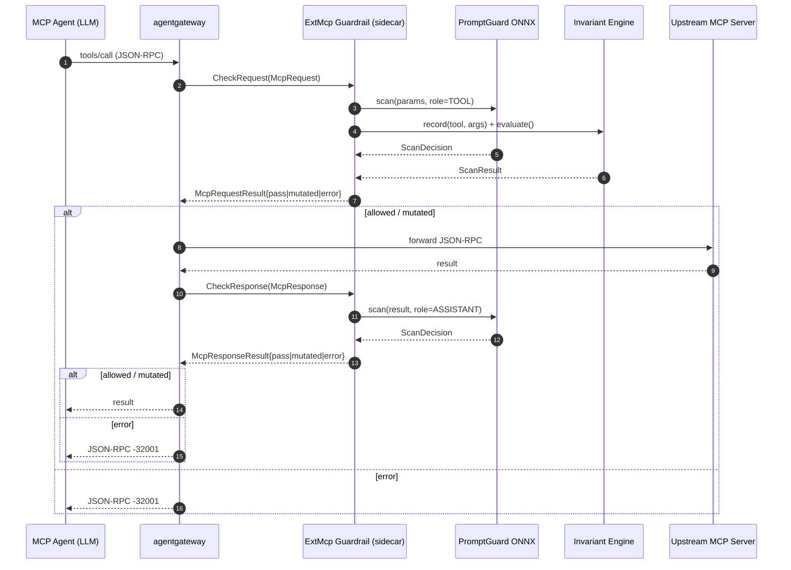

# MCP Guardrails

[](https://github.com/soulwhisper/mcp-guardrails/actions/workflows/ci.yml)
[](https://soulwhisper.github.io/mcp-guardrails/)
[](https://github.com/soulwhisper/mcp-guardrails/releases)
[](LICENSE)

An **agentgateway ExtMcp guardrail sidecar** for MCP traffic: ONNX
PromptGuard-2 prompt-injection scanning, deterministic regex scanning
(hidden Unicode / PII / secrets), an Invariant Guardrails-style rule engine
(cross-call toxic-flow / loop / rate detection), structural secret/PII
redaction, and a tamper-evident JSONL audit log — all behind the
agentgateway ExtMcp gRPC contract, **fail-closed by default**.

**Full documentation: <https://soulwhisper.github.io/mcp-guardrails/>**

## Architecture

agentgateway invokes the sidecar twice per MCP exchange via the `ExtMcp`
gRPC service (`CheckRequest` before forwarding upstream, `CheckResponse`
before returning to the agent); each call returns `pass`, `mutated`
(redacted payload), or `error` (deny → JSON-RPC `-32001`):



## Quick start

Run the sidecar (image pre-bakes the PromptGuard-2 ONNX model — no HF token,
no runtime download):

```bash
docker run --rm -p 9001:9001 \
  --env-file examples/docker-run.env \
  -v $(pwd)/examples/rules.policy:/etc/guardrails/rules.policy:ro \
  ghcr.io/soulwhisper/mcp-guardrails:0.4.0
```

Deploy on Kubernetes (Deployment + Service + ConfigMap rule pack +
`AgentgatewayPolicy` CRD, Kustomize bundle included):

```bash
kubectl apply -k deploy/k8s/
```

Wire a standalone agentgateway at the sidecar (minimal
[`examples/agentgateway.standalone.yaml`](examples/agentgateway.standalone.yaml)
excerpt):

```yaml
policies:
  mcpGuardrails:
    processors:
    - kind: remote
      host: "localhost:9001"
      failureMode: failClosed   # sidecar unreachable -> deny, never forward unguarded
      methods:
        tools/call: full        # request + response double gate
        tools/list: response    # scan tool descriptions (indirect injection)
```

Step-by-step guide with verification:
[Getting started](https://soulwhisper.github.io/mcp-guardrails/getting-started/).

## Features

- **PromptGuard-2 ONNX scanner** — Llama-family prompt-injection/jailbreak
  classifier, torch-free CPU inference, adaptive sliding windows, dual
  block/review thresholds.
  [Docs](https://soulwhisper.github.io/mcp-guardrails/guardrails/promptguard/)
- **Regex scanner** — 17 deterministic patterns (hidden/zero-width Unicode,
  PII, secrets, ChatML/format injection, markdown-image exfil) with an
  NFKC + homoglyph normalized detection view.
  [Docs](https://soulwhisper.github.io/mcp-guardrails/guardrails/regex-scanner/)
- **Invariant rule engine** — cross-call `ToxicFlowRule` / `LoopRule` /
  `RateLimitRule` / `AggregateRule` over a bounded trace window;
  hot-reloadable rule packs via `SIGHUP`.
  [Docs](https://soulwhisper.github.io/mcp-guardrails/guardrails/invariant-rules/)
- **Redaction (mutation)** — structural secret/PII masking
  (`[REDACTED:<TYPE>]`) forwarded via the proto `mutated` oneof, including
  review-grade payloads.
  [Docs](https://soulwhisper.github.io/mcp-guardrails/guardrails/redaction/)
- **Tool ACL** — `ALLOW_TOOLS` / `DENY_TOOLS` allow/deny lists with
  `prefix/*` wildcards, evaluated before any content scanner.
  [Docs](https://soulwhisper.github.io/mcp-guardrails/guardrails/tool-acl/)
- **AgentAlignment second stage (opt-in)** — cost-bounded LLM review gate,
  invoked only on first-stage `HUMAN_REVIEW`, with pre-egress redaction.
  [Docs](https://soulwhisper.github.io/mcp-guardrails/guardrails/agent-alignment/)
- **Honest scan coverage** — head/mid/tail byte windows + 1MiB payload cap;
  every coverage gap is bounded by a knob and flagged in the audit record.
  [Docs](https://soulwhisper.github.io/mcp-guardrails/guardrails/scan-coverage/)
- **Fail-closed by default** — scanner errors/timeouts deny; unreachable
  sidecar → agentgateway returns JSON-RPC `-32001`.
  [Docs](https://soulwhisper.github.io/mcp-guardrails/security-model/)
- **Always-on audit log** — one JSON line per decision with a tamper-evident
  hash chain (`guardrail_ctl audit verify`), OTel metrics/traces on top.
  [Docs](https://soulwhisper.github.io/mcp-guardrails/operations/auditing/)

## Configuration

Every knob is an environment variable. The most commonly tuned ones:

| Env var | Default | Description |
| --- | --- | --- |
| `FAILURE_MODE` | `failClosed` | `failClosed` denies on scanner failure/timeout; `failOpen` allows with a review flag. |
| `HUMAN_REVIEW_MODE` | `pass` | `pass` forwards grey-zone verdicts + audit warning; `deny` escalates to a hard deny. |
| `ENABLE_PROMPTGUARD` | `true` | ONNX PromptGuard semantic scanner (regex-only fallback when ML deps absent). |
| `ENABLE_REGEX_SCANNER` | `true` | Deterministic pattern scanner. Zero ML deps. |
| `ENABLE_REDACTION` | `true` | Structural secret/PII redaction on allowed payloads. |
| `ENABLE_AGENT_ALIGNMENT` | `false` | Opt-in second-stage LLM review gate. |
| `ALLOW_TOOLS` / `DENY_TOOLS` | _(unset)_ | Tool allow/deny lists (`prefix/*` wildcards); DENY wins. |
| `MAX_CONTENT_BYTES` | `32768` | Head-window scan budget; larger payloads get mid/tail windows + `truncated=true`. |
| `SCANNER_TIMEOUT_MS` | `500` | Per-scanner deadline; overruns handled per `FAILURE_MODE`. |
| `AUDIT_LOG_PATH` | stdout | Append-only JSONL audit log (`-`/unset → stdout, always on). |

Full reference (~40 variables, incl. PromptGuard thresholds, Invariant
trace bounds, OTel, health):
[Configuration](https://soulwhisper.github.io/mcp-guardrails/configuration/).

## Documentation

| Section | Contents |
| --- | --- |
| [Getting started](https://soulwhisper.github.io/mcp-guardrails/getting-started/) | Run / deploy / wire / verify in four steps. |
| [Guardrails](https://soulwhisper.github.io/mcp-guardrails/guardrails/) | Decision pipeline and every guardrail layer in detail. |
| [Configuration](https://soulwhisper.github.io/mcp-guardrails/configuration/) | Complete environment-variable reference. |
| [Operations](https://soulwhisper.github.io/mcp-guardrails/operations/auditing/) | Auditing, metrics, health & shutdown, review webhook. |
| [Deployment](https://soulwhisper.github.io/mcp-guardrails/deployment/) | Kubernetes manifests, agentgateway wiring, multi-replica, e2e. |
| [Security & Compliance](https://soulwhisper.github.io/mcp-guardrails/security-model/) | Threat model, failure modes, limitations, data classification. |
| [Development](https://soulwhisper.github.io/mcp-guardrails/development/) | Tests, proto sync, supply chain, release process. |

In-repo deep dives: [`ARCHITECTURE.md`](ARCHITECTURE.md) (proto contract and
engine internals), [`CHANGELOG.md`](CHANGELOG.md).

## Development

```bash
make dev    # pip install -e ".[dev]" (no ML stack — fast iteration)
make test   # 320+ unit tests, ~2s
make lint   # ruff
python3 tests/e2e_smoke.py   # live-server gRPC smoke (regex-only)
```

## Contributing

See [`CONTRIBUTING.md`](CONTRIBUTING.md) for the dev workflow, proto-stub
sync rule, how to add a scanner or Invariant rule, DCO signoff, and the
release-please process.

## Security

Fail-closed posture, threat model and failure modes:
[Security model](https://soulwhisper.github.io/mcp-guardrails/security-model/).
To report a vulnerability, do **not** open a public issue — see
[`SECURITY.md`](SECURITY.md).

## License

Licensed under the Apache License, Version 2.0 — see [`LICENSE`](LICENSE).
The bundled PromptGuard-2 model *weights* are under the Llama 4 Community
License — see [`NOTICE`](NOTICE).

## Acknowledgements

- [agentgateway](https://github.com/agentgateway/agentgateway) — the
  MCP-aware gateway whose `ExtMcp` contract this sidecar implements.
- [Prompt Guard](https://github.com/meta-llama/Prompt-Guard) (Meta) — the
  PromptGuard-2 classifier, converted to ONNX by
  [Gravitee.io](https://huggingface.co/gravitee-io/Llama-Prompt-Guard-2-86M-onnx).
- [ONNX Runtime](https://onnxruntime.ai/) — CPU inference engine for the
  PromptGuard-2 model (no torch dependency).
- [Invariant Labs](https://invariantlabs.ai/) — the toxic-flow / agent-loop
  detection research that informed the `ToxicFlowRule` / `LoopRule` shapes.
