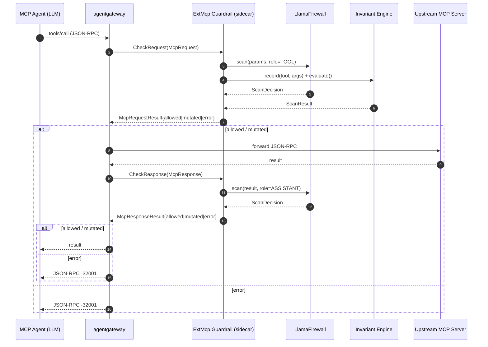
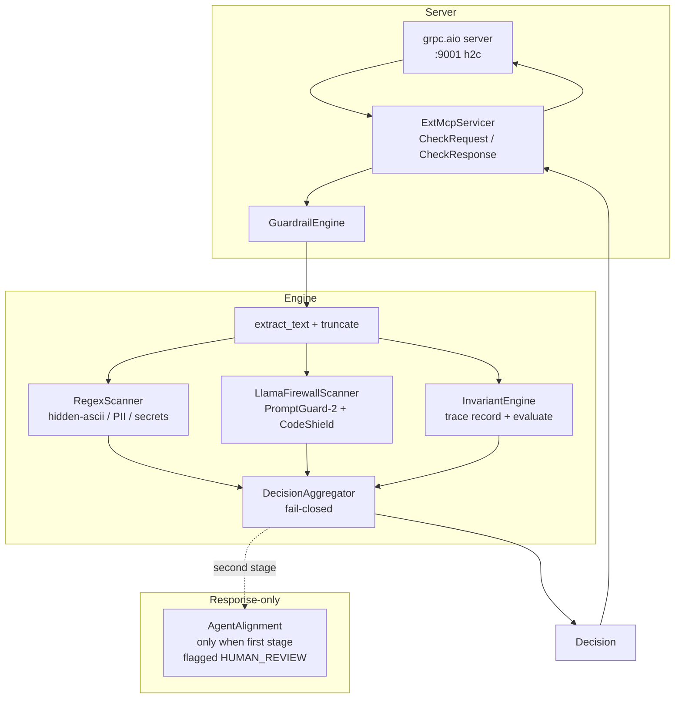

# ExtMcp Guardrail

An **agentgateway ExtMcp guardrail sidecar** that wraps [LlamaFirewall]
(Meta's semantic content scanners — PromptGuard-2, AgentAlignment, CodeShield)
and an Invariant Guardrails-style rule engine (cross-call toxic-flow / loop
detection) behind the agentgateway ExtMcp gRPC contract. The sidecar is
**fail-closed by default**, listens on plaintext HTTP/2 (`h2c`) gRPC on
`:9001`, and is driven by agentgateway's `mcp-guardrails` processor on both
sides of every MCP exchange — request params scanned as the `TOOL` role,
tool output scanned as the `ASSISTANT` role (the indirect-injection
frontline), with optional cost-bounded AgentAlignment as a second stage
gated on first-stage `HUMAN_REVIEW`.

[LlamaFirewall]: https://github.com/meta-llama/PurpleLlama-LlamaFirewall

[](LICENSE)
[](https://github.com/soulwhisper/extmcp-guardrail/pkgs/container/extmcp-guardrail)

---

## Table of contents

- [Architecture](#architecture)
- [How it works](#how-it-works)
- [Quick start](#quick-start)
- [Configuration](#configuration)
- [Rule packs](#rule-packs)
- [Deployment](#deployment)
- [Testing](#testing)
- [Security model and failure modes](#security-model-and-failure-modes)
- [Project layout](#project-layout)
- [Contributing](#contributing)
- [License](#license)
- [Acknowledgements](#acknowledgements)

---

## Architecture



Container-internal flow (every gRPC call traverses this pipeline):



## How it works

agentgateway invokes the sidecar twice per MCP exchange through the
`ExtMcp` gRPC service:

| RPC             | When agentgateway calls it                          | Sidecar's job                                                                 |
| --------------- | --------------------------------------------------- | ----------------------------------------------------------------------------- |
| `CheckRequest`  | Before forwarding the agent's request upstream      | Scan params as `TOOL` role; record + evaluate the toxic-flow trace            |
| `CheckResponse` | Before returning the upstream response to the agent | Scan tool output / tool descriptions as `ASSISTANT` role (indirect injection) |

Both RPCs return one of three states via a protobuf `oneof`:

- **`allowed` (`Pass`)** — forward the payload unchanged.
- **`mutated` (`Mutated`)** — replace the payload with the supplied bytes
  (used for future redaction / masking passes; not emitted by the default
  scanners).
- **`error` (`AuthorizationError`)** — deny. agentgateway surfaces this to
  the agent as a JSON-RPC error with code `-32001`.

> **Field-naming note.** The proto's "forward unchanged" oneof member is named
> `allowed` rather than `pass`. Only protobuf field **numbers** participate in
> the wire format, so this cosmetic name difference has zero wire-compat impact
> against agentgateway's upstream proto. The rename exists to keep the generated
> Python stubs free of `pass`-keyword collisions (`pb.McpRequestResult(pass=...)`
> is a syntax error; `pb.McpRequestResult(allowed=...)` is not). The `Pass`
> message type is unchanged. See [`ARCHITECTURE.md`](ARCHITECTURE.md) for the
> full proto reproduction.

### Fail-closed by default

`FAILURE_MODE=failClosed` is the only safe default for write-capable agents.
When a scanner raises or exceeds `SCANNER_TIMEOUT_MS`, the sidecar translates
the exception to a `BLOCK` outcome, the aggregator denies the exchange, and
agentgateway returns `-32001`. Switch to `failOpen` only for read-only agents
where a guardrail outage is judged less harmful than blocking the agent.

### Request-side double duty

On `CheckRequest` for `tools/call`, the engine does two things in parallel:

1. **Semantic scan**: extracts text from the JSON-RPC `params` object
   (`extract_text`), truncates to `MAX_CONTENT_BYTES` on a UTF-8 boundary,
   then runs the configured content scanners (`RegexScanner` for hidden
   ASCII / PII / secrets, `LlamaFirewallScanner` for PromptGuard-2 + CodeShield)
   against the text with role `TOOL`.
2. **Invariant trace**: appends `(tool, args)` to a bounded sliding window
   (`INVARIANT_WINDOW` calls, default 64) and evaluates every `ToxicFlowRule`
   and `LoopRule` against the resulting trace. First-match wins.

A `BLOCK` from either path is fail-closed by the `DecisionAggregator`; the
decision maps to the `error` oneof on the wire.

### Response-side indirect-injection defense

On `CheckResponse`, the engine scans the upstream's result text
(`content[].text` from `tools/call`, `tools[].description` from `tools/list`,
prompt bodies from `prompts/get`, etc.) as the `ASSISTANT` role. This is the
**primary defence against indirect prompt injection**: a tool that returns
attacker-controlled text (a web page, a file, a database row) is exactly
where instructions-to-the-LLM sneak back into the agent's context.

### Optional AgentAlignment second stage

`AgentAlignment` is LLM-based (~300-800ms per call). Running it on every
response would dominate sidecar latency and homelab cost, so it is **opt-in**
(`ENABLE_AGENT_ALIGNMENT=1`) and **gated**: the engine only invokes the
second-stage alignment check when a first-stage scanner (PromptGuard) flags
the response as `HUMAN_REVIEW`. This bounds the alignment cost to suspicious
responses only — the cost-control knob from the original design.

## Quick start

Prerequisites: Python 3.10+ and `pip`. The pure-Python policy core
(models, aggregator, invariant engine, regex scanner) runs without the ML
stack; LlamaFirewall is imported lazily.

```bash
# 1. Clone
git clone https://github.com/soulwhisper/extmcp-guardrail.git
cd extmcp-guardrail

# 2. Regenerate gRPC stubs (only needed if proto/ext_mcp.proto changes;
#    committed stubs are checked in so this is a no-op on a fresh clone).
make proto

# 3. Install dev/test deps (no torch / transformers — fast local iteration)
make dev

# 4. Run the unit suite (71 tests, ~0.3s)
make test

# 5. Build the container image
make docker

# 6. Run the server locally (regex-only; llamafirewall absent is graceful)
make run
```

### Docker one-liner

```bash
docker run --rm -p 9001:9001 \
  --env-file examples/docker-run.env \
  -v $(pwd)/examples/rules.policy:/etc/guardrails/rules.policy:ro \
  ghcr.io/soulwhisper/extmcp-guardrail:0.1.0
```

### Dry-run mode

`GUARDRAIL_DRY_RUN=1` swaps every real scanner for an allow-stub, so you can
verify wiring (agentgateway -> sidecar -> upstream) without loading any ML
models:

```bash
docker run --rm -p 9001:9001 \
  -e GUARDRAIL_DRY_RUN=1 \
  -e ENABLE_REGEX_SCANNER=0 \
  -e ENABLE_LLAMAFIREWALL=0 \
  ghcr.io/soulwhisper/extmcp-guardrail:0.1.0
```

### End-to-end smoke test

```bash
python3 tests/e2e_smoke.py
```

Boots a live server in a subprocess (regex-only) and exercises the full
ExtMcp gRPC surface: health check, `CheckRequest` allow + deny (hidden
Unicode), `CheckResponse` deny (private key), malformed-payload
`INVALID_ARGUMENT`.

## Configuration

Every knob is environment-variable driven so the same image serves dev,
homelab, and (with resource bumps) production. Defaults encode the
"single-user homelab" tradeoffs: PromptGuard always on, AgentAlignment
opt-in second stage, fail-closed, 32KiB content budget, 500ms scanner
deadline.

| Group         | Env var                       | Default                    | Description                                                                                                                                    |
| ------------- | ----------------------------- | -------------------------- | ---------------------------------------------------------------------------------------------------------------------------------------------- |
| Policy        | `FAILURE_MODE`                | `failClosed`               | `failClosed` denies on scanner failure/timeout (recommended for write-capable agents). `failOpen` allows with a review flag.                   |
| Policy        | `HUMAN_REVIEW_MODE`           | `pass`                     | How `HUMAN_REVIEW` outcomes are resolved. `pass` forwards + emits an audit warning; `deny` escalates to a hard deny.                           |
| Scanners      | `MAX_CONTENT_BYTES`           | `32768`                    | Max bytes of text fed to any scanner. Beyond this the payload is truncated (UTF-8-safe) and the decision is flagged `truncated=true` in audit. |
| Scanners      | `ENABLE_REGEX_SCANNER`        | `true`                     | Deterministic pattern scanner (hidden ASCII / PII / secrets). Zero ML deps.                                                                    |
| Scanners      | `ENABLE_LLAMAFIREWALL`        | `true`                     | LlamaFirewall semantic scanners (PromptGuard-2 + CodeShield). Falls back to regex-only if the package is absent.                               |
| Scanners      | `ENABLE_AGENT_ALIGNMENT`      | `false`                    | LLM-based AgentAlignment. Off by default; only triggered as a second stage when PromptGuard flags `HUMAN_REVIEW` on a response.                |
| Invariant     | `INVARIANT_WINDOW`            | `64`                       | Sliding-window size for the cross-call toxic-flow trace. Covers a typical homelab agent tool-use chain; bump for long multi-step plans.        |
| Invariant     | `INVARIANT_RULES_PATH`        | _(unset)_                  | Filesystem path to a rule pack (`.py` / `.policy`). Hot-reloadable via `SIGHUP`. Takes precedence over `INVARIANT_RULES_MODULE`.               |
| Invariant     | `INVARIANT_RULES_MODULE`      | `guardrails.rules.default` | Dotted Python module path to a rule pack. Used when `INVARIANT_RULES_PATH` is unset.                                                           |
| Timing        | `SCANNER_TIMEOUT_MS`          | `500`                      | Per-scanner deadline in milliseconds. Exceeded -> treated per `FAILURE_MODE`. Keep sidecar < gateway so the sidecar decides first.             |
| Networking    | `LISTEN_ADDR`                 | `[::]:9001`                | gRPC bind address. `127.0.0.1:9001` for loopback-only (e.g. sidecar-on-localhost).                                                             |
| Networking    | `SERVER_MAX_WORKERS`          | `8`                        | `grpc.aio` ThreadPoolExecutor size. Each in-flight RPC occupies one worker; raise for high-concurrency deployments.                            |
| Observability | `OTEL_EXPORTER_OTLP_ENDPOINT` | _(unset)_                  | OTLP/gRPC endpoint (e.g. `http://otel-collector.observability.svc:4317`). When unset or OTel SDK absent, the sidecar degrades to audit-only.   |
| Observability | `OTEL_SERVICE_NAME`           | `extmcp-guardrail`         | Service name reported on OTel spans/metrics.                                                                                                   |
| Observability | `AUDIT_LOG_PATH`              | _(unset)_                  | Append-only JSONL audit log path. `-` or unset -> stdout. Always on; survives OTel outages.                                                    |
| Misc          | `GUARDRAIL_DRY_RUN`           | `false`                    | Replace all real scanners with allow-stubs. Use to validate wiring without loading ML models.                                                  |
| Misc          | `LOG_LEVEL`                   | `INFO`                     | Python logging level (`DEBUG` / `INFO` / `WARNING` / `ERROR`).                                                                                 |

> The table above is the source of truth for runtime configuration and is
> kept in sync with `guardrails/config.py`. (The two `INVARIANT_RULES_*`
> vars are resolved by `guardrails/rules/__init__.py`.)

## Rule packs

The Invariant rule layer is a plain Python module exposing a module-level
`RULES = [...]` list. Each entry is either a `ToxicFlowRule` (an ordered
subsequence of tool calls within the trace window) or a `LoopRule` (fires
when the same `(tool, args)` fingerprint repeats `threshold` times).

### ToxicFlowRule vs LoopRule

- **`ToxicFlowRule`** — _ordered subsequence_ matcher. Steps need not be
  contiguous in the trace; intervening calls are allowed. Use for
  "X then Y" exfiltration / escalation patterns
  (e.g. `inbox_read` -> `email_send` to an external recipient).
- **`LoopRule`** — _fingerprint repetition_ matcher. The fingerprint is
  `tool + sorted_args_json`, so a parameterised search (args differ each
  call) does **not** fire — only an identical retry loop does. Use for
  prompt-injection retry storms hammering a denied tool.

### Arg matchers and dotted paths

A `FlowStep` carries a `tool` matcher (exact string, regex string,
compiled `re.Pattern`, or callable) and an optional `args` mapping of
**dotted-path** -> value matcher:

```python
FlowStep(
    tool=re.compile(r"(http|curl|fetch).*post", re.IGNORECASE),
    args={
        # Dotted path: resolves args["request"]["url"] through nested
        # dict / list structures. Integer segments are list indices
        # (e.g. "recipients.0.address").
        "request.url": _EXTERNAL_URL,
        "request.method": re.compile(r"^(POST|PUT|PATCH)$", re.IGNORECASE),
    },
)
```

Value matchers follow the same regex-vs-literal heuristic as tool matchers
(strings containing regex meta-characters are compiled and `.search()`ed;
other strings use literal `==`; callables are invoked).

### Loading

Resolution order (first non-empty wins):

1. `INVARIANT_RULES_PATH=/etc/guardrails/rules.policy` — a Python file on
   disk. **Hot-reloadable via `SIGHUP`**: send `kill -HUP 1` (or the sidecar
   PID) and the `RulePack` swaps the active rule tuple atomically behind a
   `RLock`. In-flight evaluations see the old tuple to completion.
2. `INVARIANT_RULES_MODULE=my_org.rules.production` — a dotted Python import
   path. Useful for tests / bundled packs.
3. `guardrails.rules.default` — the bundled homelab starter pack.

See [`examples/rules.policy`](examples/rules.policy) for a richer, well-commented
pack covering six patterns (inbox -> external email, secret-read -> HTTP
exfil, shell -> privileged k8s apply, db-dump -> external upload, file-read
-> webhook exfil, and a `LoopRule` retry storm).

## Deployment

### Kubernetes

The `deploy/k8s/` directory contains manifests for a Deployment + Service +
ConfigMap rule pack + an `AgentgatewayPolicy` CRD wiring the sidecar into
agentgateway. Key points:

- **`appProtocol: kubernetes.io/h2c`** on the Service port is what tells
  agentgateway this is plaintext-HTTP/2 gRPC; the sidecar binds an insecure
  port (no TLS) because the gateway handles transport security.
- **ConfigMap rule pack**: mount the rule pack at
  `/etc/guardrails/rules.policy` and set
  `INVARIANT_RULES_PATH=/etc/guardrail/rules.policy`. Reload without
  restarting the Pod by `kill -HUP 1` inside the container (the SIGHUP
  handler in `server.py` swaps the rule tuple atomically).
- **`AgentgatewayPolicy` CRD**: wire `tools/call` to `Full` (Request +
  Response double gate — the indirect-injection frontline lives on the
  Response side). `tools/list`, `prompts/get`, `resources/read` to
  `Response`. `ping` / `initialize` to `None`.
- **`failureMode: FailClosed`**: the only safe default for write-capable
  agents. If the sidecar Pod is unreachable, agentgateway returns
  JSON-RPC `-32001` to the agent rather than forwarding unguarded.
- **Readiness probe**: the gRPC `grpc.health.v1` check goes `SERVING` only
  after the engine warms up (PromptGuard-2 model load). This keeps the Pod
  out of the Service endpoints during cold start.
- **Resources**: 2Gi memory budget covers torch CPU + PromptGuard-2-86M
  (~350MB weights). Bump to 4Gi for `ENABLE_AGENT_ALIGNMENT=1` (LLM-based
  alignment holds an extra model in memory).

See [`examples/agentgateway-local.yaml`](examples/agentgateway-local.yaml)
for a non-K8s, standalone agentgateway config pointing at `localhost:9001`.

## Testing

```bash
# Unit suite (71 tests, ~0.3s) — pure-Python policy core, no ML deps required
make test

# With coverage
make test-cov

# Lint
make lint

# Live end-to-end smoke (boots a real server in a subprocess)
python3 tests/e2e_smoke.py
```

The unit suite covers the aggregator (fail-closed table), invariant engine
(ordered subsequence matching, LoopRule fingerprinting, dotted-path
resolution), scanners (regex patterns, truncation, `extract_text` hidden
Unicode preservation), the engine (timeout / exception handling, second-stage
gating), the gRPC servicer (in-process round-trip + wire mapping), and the
rule loader. The e2e smoke boots a live server, exercises health +
`CheckRequest` (allow + deny on hidden Unicode) + `CheckResponse` (deny on
private key) + malformed `INVALID_ARGUMENT`, and exits non-zero on any
mismatch.

All 71 unit tests and the e2e smoke are green on a fresh clone.

## Security model and failure modes

| Failure                                       | Behaviour                                                                                                                                                              |
| --------------------------------------------- | ---------------------------------------------------------------------------------------------------------------------------------------------------------------------- |
| Scanner raises / exceeds `SCANNER_TIMEOUT_MS` | `failClosed` -> `BLOCK` -> aggregator denies -> `error` oneof -> agentgateway returns JSON-RPC `-32001`. `failOpen` -> `HUMAN_REVIEW` -> forwarded with audit warning. |
| Sidecar Pod unreachable                       | agentgateway's mcp-guardrails processor fails closed -> MCP exchange denied -> JSON-RPC `-32001` returned to the agent.                                                |
| Model load failure (PromptGuard-2)            | Pod readiness probe stays `NOT_SERVING`; the Pod is removed from the Service endpoints. No traffic reaches a half-initialised sidecar.                                 |
| Malformed JSON-RPC payload                    | Servicer returns `AuthorizationError{INVALID_ARGUMENT}` (fail-closed on parse failure).                                                                                |
| Tool output > `MAX_CONTENT_BYTES`             | Text is truncated on a UTF-8 boundary; the decision is flagged `truncated=true` in the audit span. 32KiB default covers the attacker-relevant head of any payload.     |
| stdio upstream                                | agentgateway forwards an empty header set for stdio upstreams. Do **not** rely on headers for authn/authz when `metadata_context.upstream_transport == "stdio"`.       |

The fail-closed posture is deliberate: an agent that can call real tools
(write files, send email, apply k8s manifests) is far more dangerous when a
guardrail outage is silent than when it is loud. `-32001` is loud.

## Project layout

```
extmcp-guardrail/
├── proto/                        # ext_mcp.proto + generated pb2 stubs (committed)
│   ├── ext_mcp.proto             # ExtMcp gRPC contract (agentgateway v1alpha1)
│   ├── ext_mcp_pb2.py            # generated (do not edit; regen via `make proto`)
│   └── ext_mcp_pb2_grpc.py       # generated (do not edit; regen via `make proto`)
├── guardrails/                   # the sidecar library
│   ├── __init__.py               # public re-exports + __version__
│   ├── models.py                 # Decision, ScanResult, ScanOutcome, FailureMode, ...
│   ├── aggregator.py             # fail-closed DecisionAggregator
│   ├── invariant.py              # FlowStep, ToxicFlowRule, LoopRule, InvariantEngine
│   ├── scanners.py               # Scanner protocol, RegexScanner, LlamaFirewallScanner, Stub
│   ├── engine.py                 # GuardrailEngine orchestrator (request + response paths)
│   ├── servicer.py               # ExtMcpServicer (gRPC wire mapping)
│   ├── config.py                 # GuardrailConfig.from_env()
│   ├── otel.py                   # OTel spans/metrics + always-on JSONL audit
│   ├── proto_bridge.py           # sys.path bridge for the generated stubs
│   └── rules/
│       ├── __init__.py           # RulePack loader (path / module / env, SIGHUP reload)
│       └── default.py            # bundled homelab starter rule pack
├── tests/                        # 71 unit tests + e2e_smoke.py
├── deploy/k8s/                   # K8s manifests (Deployment, Service, ConfigMap, CRD)
├── examples/                     # rule pack, env file, local agentgateway config
├── .github/workflows/            # CI + release workflows
├── server.py                     # grpc.aio entrypoint (SIGHUP reload, SIGTERM drain)
├── Dockerfile                    # multi-stage (base/builder/models/runtime), nonroot 65532
├── Makefile                      # proto / dev / test / lint / docker / run / ci
├── pyproject.toml                # package metadata + pytest/ruff config
├── requirements.txt              # runtime deps (grpc stack pinned, ML stack pinned)
├── README.md                     # this file
├── ARCHITECTURE.md               # deep dive
├── CONTRIBUTING.md               # dev workflow
├── CHANGELOG.md                  # release history
└── LICENSE                       # Apache-2.0
```

## Contributing

See [`CONTRIBUTING.md`](CONTRIBUTING.md) for the dev workflow, the
proto-stub sync rule, how to add a scanner, how to add an Invariant rule,
the DCO/signoff note, and the release process.

## License

Licensed under the Apache License, Version 2.0. See [`LICENSE`](LICENSE).

## Acknowledgements

- [agentgateway](https://github.com/agentgateway/agentgateway) — the
  MCP-aware gateway whose `ExtMcp` contract this sidecar implements.
- [LlamaFirewall](https://github.com/meta-llama/PurpleLlama-LlamaFirewall)
  (Meta) — the semantic content scanners (PromptGuard-2, AgentAlignment,
  CodeShield) wrapped behind the request/response scan paths.
- [Invariant Labs](https://invariantlabs.ai/) — the toxic-flow / agent-loop
  detection research that informed the `ToxicFlowRule` / `LoopRule` shapes.
