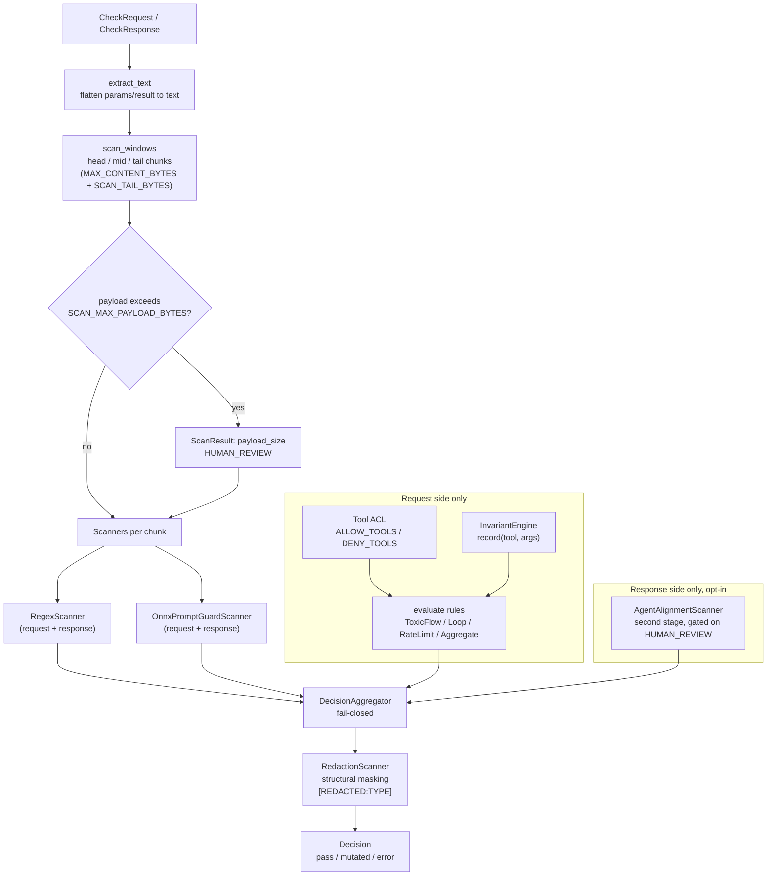

# Guardrails overview

The sidecar composes several independent guardrail layers into one decision
pipeline per MCP exchange. This page is the map; each layer has its own page.

## Decision pipeline

Order of evaluation inside the engine (`guardrails/engine.py`):

1. `extract_text` flattens the JSON-RPC `params` / `result` object into a
   scan string (see [Scan coverage](scan-coverage.md)).
2. `scan_windows` splits over-budget text into head / mid / tail chunks.
3. Payloads over `SCAN_MAX_PAYLOAD_BYTES` additionally gain a `payload_size`
   `HUMAN_REVIEW` result.
4. On the request side, the **tool ACL** runs *before* any content scanner,
   then the call is recorded into the Invariant trace and all rules are
   evaluated.
5. Content scanners run concurrently with a per-scanner deadline
   (`SCANNER_TIMEOUT_MS`, default 500ms).
6. On the response side, a first-stage `HUMAN_REVIEW` optionally triggers the
   second-stage AgentAlignment LLM gate.
7. The **aggregator** folds every `ScanResult` into one `Decision`.
8. If nothing blocked, the **redaction** transformer masks secrets/PII and
   attaches the rewritten payload via the proto `mutated` oneof.

## Outcome semantics

Every scanner returns a `ScanResult` with one of three outcomes
(`guardrails/models.py`):

| Outcome        | Meaning                                                        | Aggregator behaviour                                              |
| -------------- | -------------------------------------------------------------- | ----------------------------------------------------------------- |
| `ALLOW`        | Content is clean.                                              | Exchange passes (optionally mutated by redaction).                 |
| `BLOCK`        | Hard deny.                                                     | Short-circuits everything; decision maps to the `error` oneof.     |
| `HUMAN_REVIEW` | Grey zone — suspicious but not certain.                        | Resolved per `HUMAN_REVIEW_MODE`: `pass` (forward + audit warning, the default) or `deny` (escalate). When AgentAlignment is enabled, response-side reviews go through the second-stage LLM gate first. |

The wire-visible results are the three proto states: `pass`, `mutated`
(allowed but rewritten by redaction), and `error` (denied).

## Fail-closed model

`FAILURE_MODE=failClosed` is the default and the only safe posture for
write-capable agents:

- A scanner exception or timeout (`SCANNER_TIMEOUT_MS` exceeded) is translated
  into a `BLOCK` outcome under `failClosed`; under `failOpen` it becomes
  `HUMAN_REVIEW` (forwarded with an audit warning).
- If the sidecar is unreachable, agentgateway's own mcp-guardrails processor
  fails closed and returns JSON-RPC `-32001` to the agent.
- A malformed JSON-RPC payload yields `AuthorizationError{INVALID}`.
- Model-load failure keeps the Pod's readiness probe `NOT_SERVING`, so no
  traffic reaches a half-initialised sidecar.

Deny reasons on the wire are deliberately generalised
(`denied by content policy` / `denied by response policy` plus a short
correlation `ref`); the full internal reason — scanner, pattern, match
fingerprint — lives only in the [audit log](../operations/auditing.md), so a
caller cannot iterate a payload against scanner feedback.

## The guardrails

| Guardrail | Layer | Page |
| --- | --- | --- |
| RegexScanner (17 built-in patterns) | Deterministic content | [Regex scanner](regex-scanner.md) |
| OnnxPromptGuardScanner (PromptGuard-2-86M) | ML content | [PromptGuard](promptguard.md) |
| AgentAlignmentScanner (second-stage LLM) | ML content, opt-in | [Agent alignment](agent-alignment.md) |
| RedactionScanner (mutation) | Transformer | [Redaction](redaction.md) |
| InvariantEngine (4 rule types + default pack) | Cross-call rules | [Invariant rules](invariant-rules.md) |
| Tool ACL (ALLOW/DENY) | Request gate | [Tool ACL](tool-acl.md) |
| Scan windows + payload cap | Coverage control | [Scan coverage](scan-coverage.md) |
