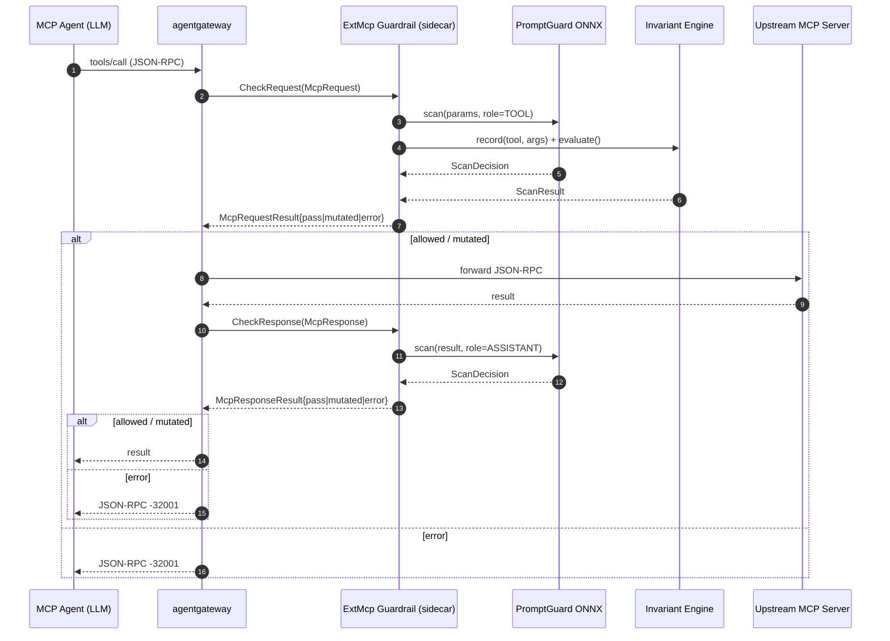
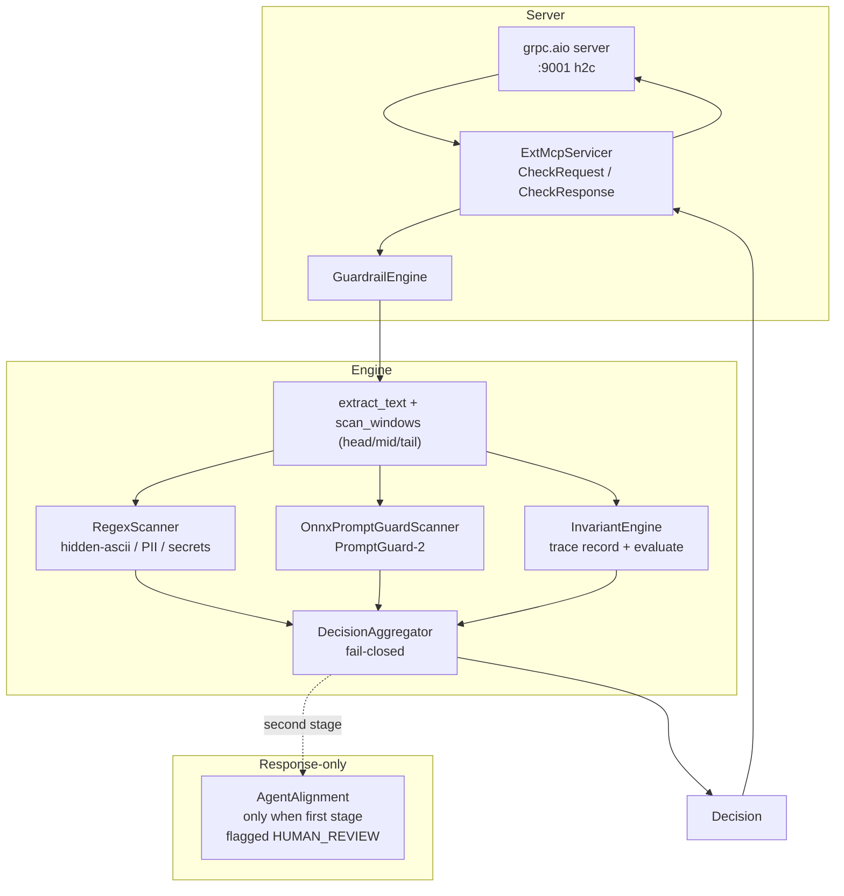

# MCP Guardrails

An **agentgateway ExtMcp guardrail sidecar** that wraps an ONNX-based
PromptGuard-2 scanner (prompt-injection detection via the
[gravitee-io/Llama-Prompt-Guard-2-86M-onnx](https://huggingface.co/gravitee-io/Llama-Prompt-Guard-2-86M-onnx)
model) and an Invariant Guardrails-style rule engine (cross-call toxic-flow /
loop detection) behind the agentgateway ExtMcp gRPC contract.

The sidecar is **fail-closed by default**, listens on plaintext HTTP/2 (`h2c`)
gRPC on `:9001`, and is driven by agentgateway's `mcp-guardrails` processor on
both sides of every MCP exchange — request params scanned as the `TOOL` role,
tool output scanned as the `ASSISTANT` role (the indirect-injection frontline),
with an optional cost-bounded AgentAlignment LLM as a second stage gated on
first-stage `HUMAN_REVIEW`.

Current version: **v0.4.0**.

## Project scope

This project is a **pure guardrail**: detection, blocking/mutation verdicts,
and audit. Deliberately out of scope:

- **Rewriting / normalisation policies** (canonicalisation, paraphrasing,
  content transformation as a policy primitive) are the job of other
  agentgateway modules. The one exception is the built-in
  [redaction](guardrails/redaction.md) capability, which masks secrets/PII in
  otherwise-forwarded payloads.
- **Network isolation is the deployer's responsibility.** The sidecar binds
  plaintext h2c on `:9001` with no authentication of its own; protecting the
  gateway↔sidecar path (Kubernetes `NetworkPolicy`, mTLS via a service mesh,
  namespace segmentation) belongs to the platform, not this repo.

## Architecture



Container-internal flow (every gRPC call traverses this pipeline):



## Relationship to agentgateway

agentgateway invokes the sidecar twice per MCP exchange through the `ExtMcp`
gRPC service:

| RPC             | When agentgateway calls it                          | Sidecar's job                                                                 |
| --------------- | --------------------------------------------------- | ----------------------------------------------------------------------------- |
| `CheckRequest`  | Before forwarding the agent's request upstream      | Scan params as `TOOL` role; record + evaluate the toxic-flow trace            |
| `CheckResponse` | Before returning the upstream response to the agent | Scan tool output / tool descriptions as `ASSISTANT` role (indirect injection) |

Both RPCs return one of three states via a protobuf `oneof`:

- **`pass` (`Pass`)** — forward the payload unchanged.
- **`mutated` (`bytes`)** — replace the payload with the supplied raw JSON
  bytes (emitted by the redaction stage).
- **`error` (`AuthorizationError`)** — deny. agentgateway surfaces this to the
  agent as a JSON-RPC error (`-32001`).

The vendored contract lives in `proto/ext_mcp.proto` (from
`agentgateway/agentgateway`, `crates/protos/proto/ext_mcp.proto`).

## Quick start

### 1. Run the sidecar (Docker)

```bash
docker run --rm -p 9001:9001 \
  --env-file examples/docker-run.env \
  -v $(pwd)/examples/rules.policy:/etc/guardrails/rules.policy:ro \
  ghcr.io/soulwhisper/mcp-guardrails:0.4.0
```

The image pre-bakes the PromptGuard-2 ONNX model (pinned via the
`PG2_REVISION` build-arg), so no HuggingFace token and no runtime download is
needed.

### 2. Deploy on Kubernetes

Apply the manifests in `deploy/k8s/` (Deployment + Service + ConfigMap rule
pack + `AgentgatewayPolicy` CRD). See the [Deployment](deployment.md) guide
for the full walkthrough.

### 3. Wire agentgateway

Either mount the `AgentgatewayPolicy` CRD (Kubernetes) or point a standalone
agentgateway at the sidecar with
[`examples/agentgateway.standalone.yaml`](https://github.com/soulwhisper/mcp-guardrails/blob/main/examples/agentgateway.standalone.yaml).
The policy maps `tools/call` to `Full` (request + response double gate),
`tools/list` / `prompts/get` / `resources/read` to `Response`, and
`ping` / `initialize` to `None`.

## Where to next

- [Guardrails overview](guardrails/index.md) — the decision pipeline and every
  guardrail in detail.
- [Configuration](configuration.md) — the complete environment-variable
  reference.
- [Security model](security-model.md) — threat model, failure modes and known
  limitations.
- [Development](development.md) — tests, proto sync, release process.
