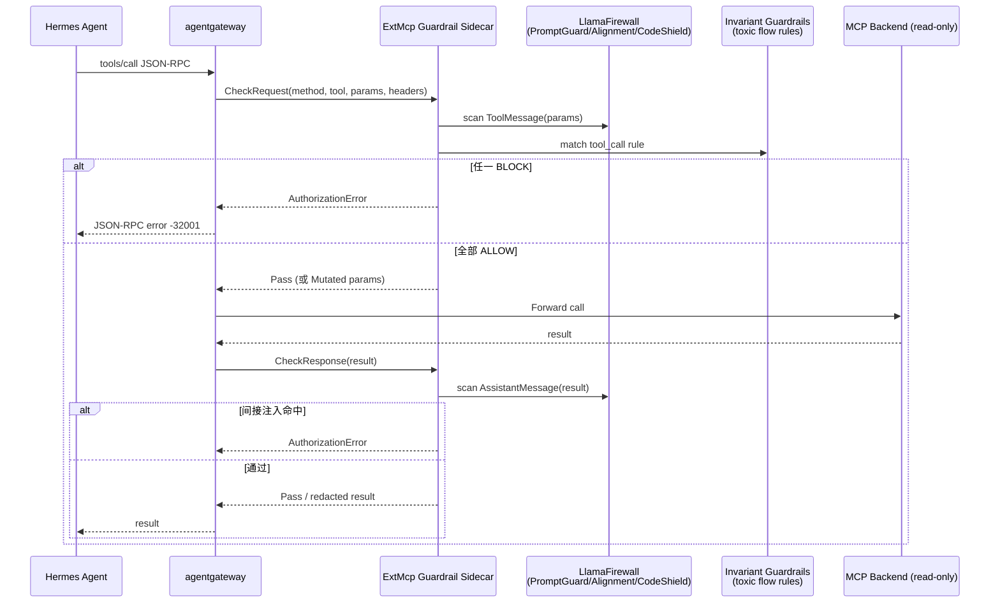
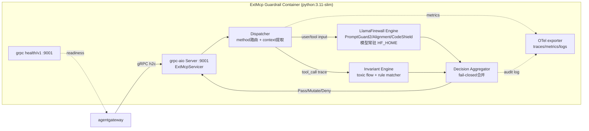

## 核心设计思路

将 LlamaFirewall 与 Invariant Guardrails 封装为一个实现 agentgateway **ExtMcp gRPC 协议**的 sidecar 容器，作为 `tools/call` 请求与响应的双向策略服务器。ExtMcp 协议基于 Envoy ext_authz 模型，但在 MCP 方法层调用，提供两个 RPC：`CheckRequest(McpRequest)→McpRequestResult` 与 `CheckResponse(McpResponse)→McpResponseResult`，返回 Pass / Mutated / AuthorizationError 三态【turn12find0】【turn2find0】。容器内部用 Python grpc-aio 实现 ExtMcp servicer，把 MCP JSON-RPC 的 `params`/`result` 原始字节解出后，分别交给 LlamaFirewall（语义层：注入/对齐/代码安全）与 Invariant Guardrails（规则层：toxic flow / 工具链匹配）做检测，再按 fail-closed 策略聚合为 Pass / Mutate / Deny 返回 agentgateway【turn4fetch0】。



## 容器内部架构

容器以 Python 3.11-slim 为基础，单进程跑 grpc-aio Server，监听 `:9001`（h2c，匹配 agentgateway `appProtocol: kubernetes.io/h2c` 要求）【turn4fetch1】。进程内三个逻辑层：



关键模块职责：

- **ExtMcpServicer**：实现 `CheckRequest`/`CheckResponse`，从 `McpRequest.mcp_request`（原始 JSON 字节）反序列化出 MCP params，从 `McpResponse.mcp_response` 取 result【turn12find0】
- **Dispatcher**：按 `method` 字段路由——`tools/call` 走输入侧（params 含 tool name + arguments）+ 输出侧（result 含工具返回内容）；`tools/list` 走输出侧（扫描工具描述是否含投毒指令）；`prompts/get`、`resources/read` 视配置启用
- **LlamaFirewall Engine**：单例初始化 `LlamaFirewall(scanners={Role.TOOL: [PROMPT_GUARD, AGENT_ALIGNMENT], Role.ASSISTANT: [PROMPT_GUARD], Role.USER: [PROMPT_GUARD, CODE_SHIELD, HIDDEN_ASCII]})`，模型缓存在 `/models/hf` 避免运行时下载【turn7fetch0】【turn13find1】
- **Invariant Engine**：加载 Python 规则文件，匹配跨调用的 toxic flow（如"读 inbox → 发外部邮件"组合），维护一个滑动窗口的 tool_call trace 供规则引用【turn1search5】
- **Decision Aggregator**：两引擎都 ALLOW → Pass；任一 BLOCK → AuthorizationError；LF 返回 `HUMAN_IN_THE_LOOP_REQUIRED` → 视配置降级为 Pass+告警或升级为 Deny；Invariant 命中 → Deny

## gRPC 适配层实现要点

先生成 Python stub：从 agentgateway 仓库拉取 `crates/protos/proto/ext_mcp.proto`【turn10search0】，连同其 `google/protobuf/struct.proto` 依赖一起 `grpcio-tools` 生成。servicer 骨架如下：

```python
# server.py
import grpc, asyncio, json, struct
from grpc_health.v1 import health, health_pb2, health_pb2_grpc
from concurrent import futures
import ext_mcp_pb2 as pb
import ext_mcp_pb2_grpc as pb_grpc
from guardrails.engine import GuardrailEngine

class ExtMcpServicer(pb_grpc.ExtMcpServicer):
    def __init__(self, engine: GuardrailEngine):
        self._e = engine

    async def CheckRequest(self, request: pb.McpRequest, context):
        # mcp_request 是 JSON-RPC params 的原始字节，可能为空
        params = json.loads(request.mcp_request) if request.mcp_request else {}
        tool_name = params.get("name", "") if request.method == "tools/call" else ""
        decision = await self._e.check_request(
            method=request.method,
            service_names=list(request.service_names),
            tool_name=tool_name,
            params=params,
            headers={h.key: h.value for h in request.headers},
        )
        if decision.deny:
            return pb.McpRequestResult(
                error=pb.AuthorizationError(
                    code=pb.AuthorizationError.PERMISSION_DENIED,
                    message=decision.reason,
                )
            )
        if decision.mutated_params is not None:
            return pb.McpRequestResult(mutated=json.dumps(decision.mutated_params).encode())
        return pb.McpRequestResult(pass=pb.Pass())

    async def CheckResponse(self, request: pb.McpResponse, context):
        result = json.loads(request.mcp_response) if request.mcp_response else {}
        decision = await self._e.check_response(
            method=request.method,
            service_names=list(request.service_names),
            result=result,
        )
        if decision.deny:
            return pb.McpResponseResult(
                error=pb.AuthorizationError(
                    code=pb.AuthorizationError.PERMISSION_DENIED,
                    message=decision.reason,
                )
            )
        if decision.mutated_result is not None:
            return pb.McpResponseResult(mutated=json.dumps(decision.mutated_result).encode())
        return pb.McpResponseResult(pass=pb.Pass())

async def serve():
    server = grpc.aio.server(futures.ThreadPoolExecutor(max_workers=8))
    engine = GuardrailEngine.from_env()
    await engine.awarm()  # 预热 LF 模型
    pb_grpc.add_ExtMcpServicer_to_server(ExtMcpServicer(engine), server)
    # health/v1 供 agentgateway readiness 探测
    hs = health.aio.HealthServicer()
    health_pb2_grpc.add_HealthServicer_to_server(hs, server)
    await hs.set("ExtMcp", health_pb2.HealthCheckResponse.SERVING)
    server.add_insecure_port("[::]:9001")  # h2c
    await server.start()
    await server.wait_for_termination()

asyncio.run(serve())
```

`GuardrailEngine` 内部对 LlamaFirewall 与 Invariant 的调用映射：

```python
# guardrails/engine.py
from llamafirewall import LlamaFirewall, Role, ScannerType, UserMessage, ToolMessage, AssistantMessage, ScanDecision

class GuardrailEngine:
    def __init__(self, lf: LlamaFirewall, inv_rules: list):
        self._lf = lf
        self._inv = inv_rules
        self._call_trace = collections.deque(maxlen=64)  # Invariant toxic flow 窗口

    async def check_request(self, *, method, service_names, tool_name, params, headers):
        # 1) LlamaFirewall：tools/call 的 arguments 作为 TOOL 角色扫描
        args_text = json.dumps(params.get("arguments", {}))
        lf_res = await self._lf.scan_async(ToolMessage(content=args_text))
        if lf_res.decision == ScanDecision.BLOCK:
            return Decision(deny=True, reason=f"LF:block:{lf_res.scanner}")
        # 2) Invariant：记录 tool_call 进 trace，匹配 toxic flow
        self._call_trace.append({"tool": tool_name, "args": params.get("arguments", {})})
        for rule in self._inv:
            hit = rule.match(self._call_trace)
            if hit:
                return Decision(deny=True, reason=f"INV:{rule.name}")
        # 3) 隐藏 ASCII / PII 可在此追加
        return Decision(deny=False)

    async def check_response(self, *, method, service_names, result):
        # 间接注入核心防线：工具返回内容作为 ASSISTANT 角色过 PromptGuard
        content = json.dumps(result.get("content", result))
        lf_res = await self._lf.scan_async(AssistantMessage(content=content))
        if lf_res.decision == ScanDecision.BLOCK:
            return Decision(deny=True, reason=f"LF:indirect_injection")
        return Decision(deny=False)
```

`scan_async` 需要 LlamaFirewall ≥ 0.9 提供的 async 接口；若版本仅同步 `scan`，则用 `asyncio.to_thread` 包一层避免阻塞事件循环。PromptGuard 2 是 BERT-classifier，单次推理 P95 约 15–30ms；AgentAlignment 是 LLM-based，单次 300–800ms——后者建议只在 `check_response` 命中 PromptGuard 可疑时作为二级确认触发，而非默认全量开启，以控制 P95。

## Dockerfile

```dockerfile
FROM python:3.11-slim AS base
ENV PYTHONUNBUFFERED=1 HF_HOME=/models/hf PYTHONDONTWRITEBYTECODE=1
RUN apt-get update && apt-get install -y --no-install-recommends \
        ca-certificates curl && rm -rf /var/lib/apt/lists/*

FROM base as builder
WORKDIR /build
COPY requirements.txt .
RUN pip install --no-cache-dir --prefix=/install -r requirements.txt

FROM base AS runtime
RUN useradd -u 65532 -r -s /sbin/nologin nonroot
COPY --from=builder /install /usr/local
COPY proto/ext_mcp_pb2.py proto/ext_mcp_pb2_grpc.py /app/proto/
COPY server.py guardrails/ /app/
# 预下载 PromptGuard 模型到镜像，避免运行时拉取
RUN python -c "from transformers import AutoModelForSequenceClassification, AutoTokenizer; \
    m='meta-llama/Prompt-Guard-2-86M'; AutoTokenizer.from_pretrained(m).save_pretrained('/models/hf/pg2'); \
    AutoModelForSequenceClassification.from_pretrained(m).save_pretrained('/models/hf/pg2')"
WORKDIR /app
USER 65532:65532
EXPOSE 9001
HEALTHCHECK --interval=10s --timeout=3s --retries=3 \
    CMD grpcurl -plaintext -d '{"service":"grpc.health.v1.Health"}' localhost:9001 grpc.health.v1.Health/Check || exit 1
ENTRYPOINT ["python", "server.py"]
```

`requirements.txt` 关键依赖：

```
grpcio==1.81.0
grpcio-tools==1.81.0
grpcio-health-checking==1.81.0
llamafirewall>=0.9.0
transformers>=4.45.0
torch==2.4.0  # CPU
invariant-ai>=0.0.4
opentelemetry-sdk==1.28.0
opentelemetry-exporter-otlp==1.28.0
```

镜像体积约 1.8–2.2GB（torch CPU + 模型权重），通过多阶段构建把构建依赖排除在外。若要进一步瘦身，可换 `python:3.11-alpine` + onnxruntime 跑 PromptGuard ONNX 版。

## K8s 部署清单

```yaml
apiVersion: apps/v1
kind: Deployment
metadata:
  name: extmcp-guardrail
  namespace: agent-system
spec:
  replicas: 2
  selector:
    matchLabels: { app: extmcp-guardrail }
  template:
    metadata:
      labels: { app: extmcp-guardrail }
    spec:
      securityContext:
        runAsNonRoot: true
        runAsUser: 65532
        fsGroup: 65532
        seccompProfile: { type: RuntimeDefault }
      containers:
        - name: guardrail
          image: ghcr.io/soulwhisper/extmcp-guardrail:0.1.0
          ports:
            - { containerPort: 9001, name: grpc-h2c }
          env:
            - { name: FAILURE_MODE, value: "failClosed" }
            - {
                name: OTEL_EXPORTER_OTLP_ENDPOINT,
                value: "http://otel-collector.observability.svc:4317",
              }
            - {
                name: INVARIANT_RULES_PATH,
                value: "/etc/guardrails/rules.policy",
              }
          resources:
            requests: { cpu: "500m", memory: "2Gi" }
            limits: { cpu: "2", memory: "4Gi" }
          readinessProbe:
            grpc: { port: 9001, service: "grpc.health.v1.Health" }
            initialDelaySeconds: 5
            periodSeconds: 5
          livenessProbe:
            grpc: { port: 9001 }
            initialDelaySeconds: 30
            periodSeconds: 15
          volumeMounts:
            - { name: rules, mountPath: /etc/guardrails, readOnly: true }
      volumes:
        - name: rules
          configMap: { name: guardrail-rules }
---
apiVersion: v1
kind: Service
metadata:
  name: extmcp-guardrail
  namespace: agent-system
spec:
  selector: { app: extmcp-guardrail }
  ports:
    - {
        port: 4445,
        targetPort: 9001,
        protocol: TCP,
        appProtocol: kubernetes.io/h2c,
      }
```

`appProtocol: kubernetes.io/h2c` 是 agentgateway 连接 ExtMCP 服务器的硬性要求——明文 HTTP/2 上的 gRPC【turn4fetch1】。ConfigMap `guardrail-rules` 存放 Invariant 的 Python 规则与 LlamaFirewall scanner 配置，走 GitOps 随仓库版本化。

## agentgateway 侧 MCP Guardrails Policy 对接

在 `AgentgatewayPolicy` 中把该 Service 注册为 processor，对 `tools/call` 同时启用 Request 与 Response 阶段（Request 阶段挡直接注入/参数投毒，Response 阶段挡间接注入），对 `tools/list` 启用 Response 阶段（扫描工具描述投毒）【turn4fetch1】：

```yaml
apiVersion: agentgateway.dev/v1alpha1
kind: AgentgatewayPolicy
metadata:
  name: mcp-guardrails
  namespace: agent-system
spec:
  targetRefs:
    - group: agentgateway.dev
      kind: AgentgatewayBackend
      name: mcp-backend
  backend:
    mcp:
      guardrails:
        processors:
          - remote:
              backendRef:
                name: extmcp-guardrail
                port: 4445
            failureMode: FailClosed # sidecar 不可达时拒绝，单用户场景宁可阻断不可放行
            methods:
              tools/call: Full # Request + Response 双阶段
              tools/list: Response # 仅响应阶段扫描工具描述
              prompts/get: Response
              resources/read: Response
```

多 processor 链式时，agentgateway 按顺序执行，任一 deny 即短路【turn4fetch0】。若后续要把授权与内容审计分离，可加第二个 processor 指向专门的授权 sidecar。

## 关键工程决策

| 决策点              | 选择                            | 理由                                                                                                 |
| ------------------- | ------------------------------- | ---------------------------------------------------------------------------------------------------- |
| 语言/运行时         | Python 3.11 + grpc-aio          | LlamaFirewall 与 Invariant 均为 Python 库，原生调用避免跨语言桥接；grpc-aio 异步避免 LF 同步推理阻塞 |
| 模型加载            | 镜像内置 + 单例常驻             | PromptGuard 2-86M 约 350MB，启动时 `await engine.awarm()` 预热，避免首请求冷启动 5–10s 超时          |
| AgentAlignment 触发 | 仅在 PromptGuard 可疑时二级确认 | 全量开启会把 P95 从 ~30ms 拉到 ~800ms，单用户 Homelab 无法接受                                       |
| 失败模式            | FailClosed                      | sidecar 故障时 agentgateway 直接拒绝 MCP 调用，符合"宁可阻断不可放行"原则                            |
| 副本数              | 2                               | 单副本故障即全链路阻断；2 副本 + readinessProbe 保证滚动更新零中断                                   |
| 资源限制            | 2 CPU / 4Gi                     | PromptGuard CPU 推理 + transformers 加载约需 1.5Gi 常驻                                              |
| Trace 窗口          | deque maxlen=64                 | Invariant toxic flow 需要跨调用上下文，64 步覆盖典型 Agent 工具链长度                                |
| 可观测性            | OTel OTLP → 既有 Loki/Vector    | 复用 home-ops 已有可观测栈，每条决策产出 audit span                                                  |

## 边界与故障场景处置

- **FailClosed 下 sidecar 不可达**：agentgateway 直接返回 JSON-RPC `-32001` 给 Agent，Agent 应被配置为将该错误视为"工具不可用"而非重试，避免雪崩【turn4fetch0】
- **LlamaFirewall 模型加载失败**：health check 设为 `NOT_SERVING`，Pod 被 readinessProbe 摘除，流量切到另一副本；若两副本同时故障，整条 MCP 链路进入 fail-closed 闭环
- **Invariant 规则热更新**：规则文件挂 ConfigMap，通过 `SIGHUP` 或 `inotify` 触发引擎 reload，无需重启 Pod；reload 期间用读写锁保证 trace 一致性
- **超时控制**：servicer 内对每个引擎调用设 500ms deadline，超时按 FailClosed 处理；agentgateway 侧 processor 也有超时，建议 sidecar 端 < gateway 端（如 800ms vs 1000ms），让 sidecar 先做决策
- **大 result 截断**：`tools/call` 返回的文件内容可能数 MB，扫描前按 32KB 截断并在 audit log 标记 `truncated=true`，避免 OOM 与推理延迟爆炸
- **stdio upstream**：ExtMcp 对 stdio MCP server 的 headers 字段为空【turn12find0】，servicer 不得依赖 headers 做鉴权，应只依赖 `metadata_context` 与 params 内容

## Homelab 单用户场景的成本取舍

单用户场景下该 sidecar 的实际收益与成本需重新权衡：

- **收益**：把 LlamaFirewall + Invariant 从"应用内库调用"升级为"网关级强制策略"，Hermes Agent 升级或换框架时 guardrail 不丢失；间接注入（工具返回内容投毒）这条最致命的链路有了独立于 Agent 的兜底
- **成本**：2 副本 × 4Gi = 8Gi 内存常驻，PromptGuard 推理给每次 MCP 调用增加 20–40ms 延迟，AgentAlignment 二级确认偶发增加 300–800ms
- **单用户取舍建议**：副本数可降到 1（单用户可接受偶发阻断做手动重试）；AgentAlignment 默认关闭，仅 PromptGuard + Invariant 规则层常开；resource limits 降到 1 CPU / 2Gi； FailClosed 保持不变——单用户场景下"被投毒的 Agent 拿到 k8s/Flux 写权限"的损失远大于"偶发工具调用阻断"

容器化 LlamaFirewall + Invariant 的真正价值不在性能，而在于把 guardrail 从 Agent 进程内剥离为**独立可审计、可版本化、可独立升级的策略边界**——这与 home-ops 仓库 GitOps 优先的整体哲学一致。
